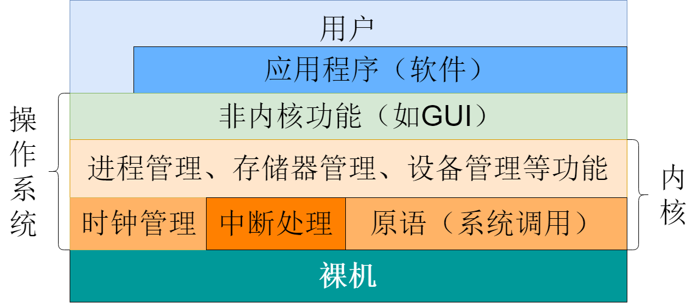
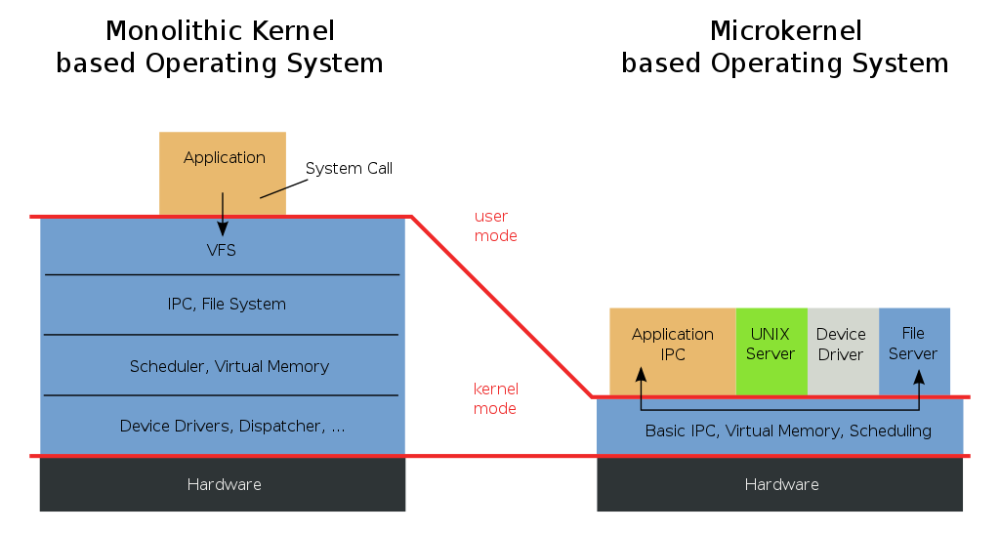

## 操作系统的内核

[内核](https://zh.wikipedia.org/wiki/%E5%86%85%E6%A0%B8)（[Kernel](https://en.wikipedia.org/wiki/Kernel_(operating_system))，又称核心）是处于计算机操作系统核心的程序，它完全控制着整个系统的运行。它是常驻于内存的一段操作系统代码，为人机互动提供基础设施。

一个完整的内核控制控制着计算机的所有外设资源，并协调进程间对于资源的分配，最大化地利用公共资源。在大多数系统中，内核是在开机引导程序后启动，负责处理其余资源（如内存、外设和输入输出请求），并将他们转化成数据计算处理指令递交给CPU。

## 单内核与微内核

