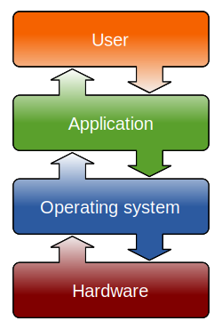
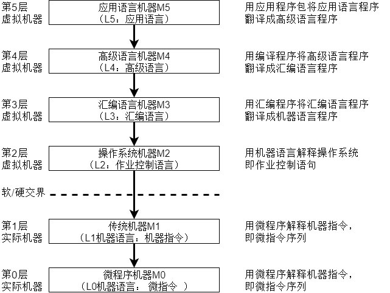

## 操作系统的概念

计算机系统自下而上可大致分为4部分：**硬件**、**操作系统**、 **应用程序** 和 **用户**（这里的划分与计算机组成原理中的分层不同）。

其中，**操作系统**（[Operating System](https://en.wikipedia.org/wiki/Operating_system)，OS），是指控制和管理整个计算机系统的硬件与软件资源，合理地组织、调度计算机的工作与资源的分配，进而为用户和其他软件提供方便接口与环境的程序集合。

## 操作系统的特征

操作系统作为系统软件，同时也是最底层的软件，包含着很多特性，我们视作操作系统的基本特征。操作系统的基本特征包括 **并发**、**共享**、**虚拟** 和 **异步**。

* **并发（Concurrence）**：两个或多个事件在同一时间间隔发生
  1. 并发是同一时间间隔多事件同时发生
  2. 并性是同一时刻内多道程序同时执行
* **共享（Sharing）**：系统内的资源可供内存中多个并发执行的进程共同使用。
  1. 互斥共享方式：任何时间仅允许单个进程访问使用资源
  2. 同时访问方式：某段时间可以有多个进程同时访问资源
* **虚拟（Virtual）**：把物理上的实体虚拟成若干逻辑上的对应物
  1. 虚拟处理器技术：多道程序技术复制物理CPU为逻辑CPU
  2. 虚拟存储器技术：将物理上的存储器虚拟成逻辑上虚拟存储
* **异步（Asynchronism）**：对象及其行为没有在时间上协调运行

## 操作系统的功能

作为计算机中最基本的系统软件，操作系统实现很多底层的功能

### 操作系统作为系统资源的管理者

1. **处理器管理**
   在多道程序环境下，处理器分配和运行都以进程（或线程）为基本单位，因而对处理器的管理可归结为对进程的管理。主要包括：进程控制、进程同步、进程通信、死锁处理 以及 处理器调度 等功能。
2. **存储器管理**
   存储器管理是为了给多道程序以良好的运行环境，方便用户使用及提高内存的利用率。主要包括：内存的分配与回收、地址映射、内存保护与共享 以及 内存扩充 等功能。
3. **文件管理**
   计算机中的信息都是以文件的形式存在的，操作系统中负责文件管理的部分称为文件系统。文件管理包括：文件存储空间管理、目录管理 以及 文件读写管理和保护 等功能。
4. **设备管理**
   设备管理的任务是完成用户的I/O请求，方便用户使用各种设备，并提高设备的利用率。主要包括：缓冲管理、设备分配、设备处理 和 虚拟设备 等功能。

### 操作系统作为用户与计算机硬件系统之间的接口

为了让用户方便快捷可靠地操纵计算机硬件并运行自己的程序，操作系统提供用户接口。操作系统提供接口分为两类：一类是命令接口，用户利用这些操作命令来组织和控制作业的执行；另一类是程序接口，编程人员可以使用它们来请求操作系统服务。

1. **命令接口**
   使用命令接口进行作业控制的方式主要有两种，联机控制方式和脱机控制方式。以此将命令接口分为以下两类：
   * 联机命令接口（交互式命令接口）：输入一条命令后给出反馈
   * 脱机命令接口（批处理命令接口）：输入一组命令后等待结果
2. **程序接口**
   程序接口是由一组系统调用（广义指令）组成。用户通过使用这些系统调用请求操作系统为其提供服务。

### 操作系统用作扩展机器

没有任何软件支持的计算机称为逻辑，它构成计算机系统的物质基础，而安装操作系统后的机器提供更多资源管理的功能，我们可以将其视作功能更强的扩展机器。

