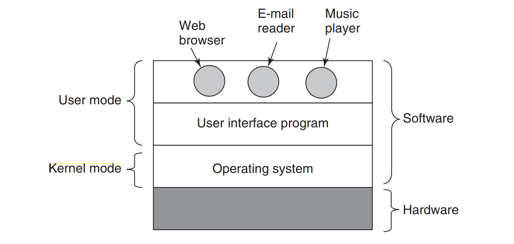
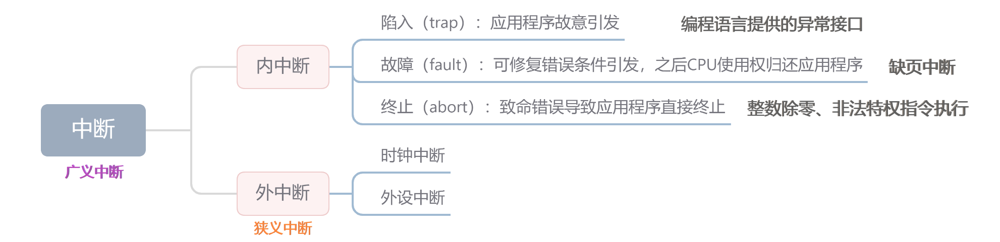
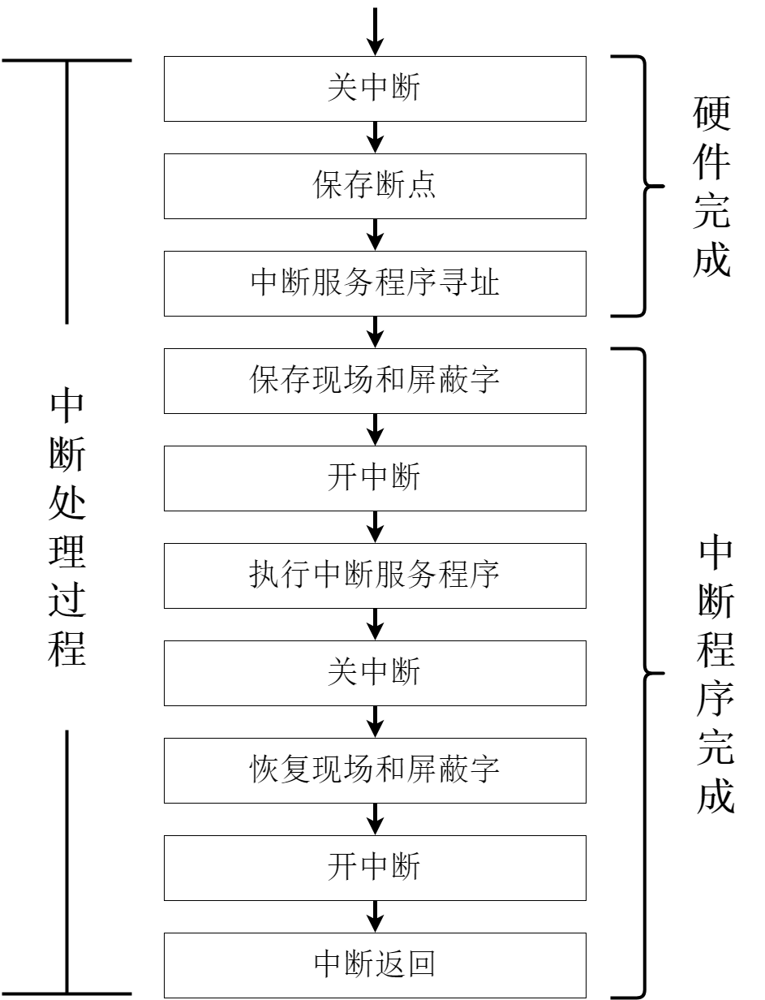
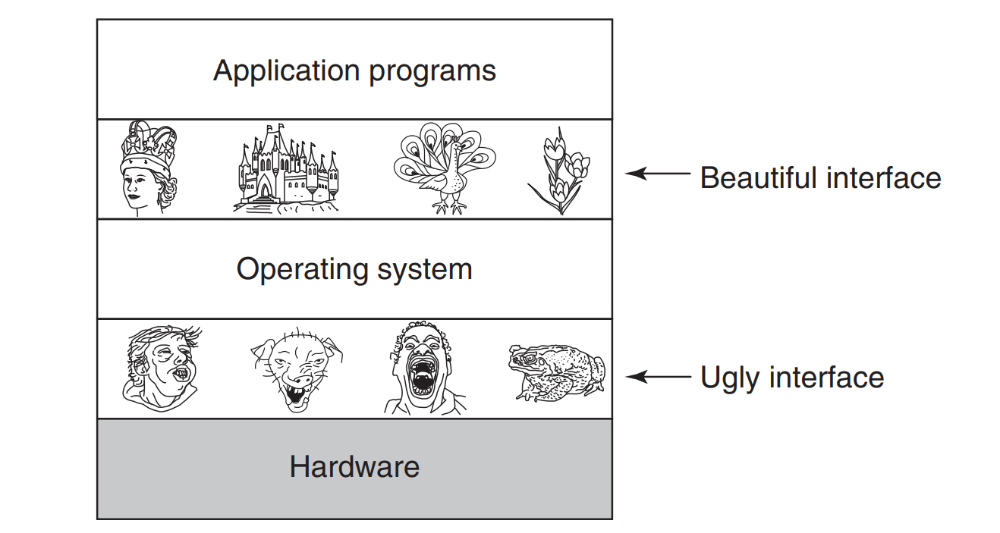
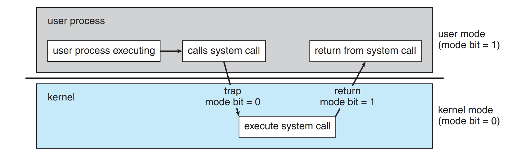

## 内核态与用户态

多道程序处理系统中，要保证不同用户程序之间不能相互干涉，所以某些计算机指令只在相应权限下才能执行，我们把这种指令叫做特权指令。

对于计算机操作系统，程序可以在两种不同的模式下执行：**内核态**（管态） 与 **用户态**（目态）。其中，前者时具有比后者更高的权限。操作系统的内核程序直接运行在管态中，它主要包括一下几方面的内容。

1. **时钟管理**
   计算机的各种部件中，时钟（Timer）是最关键的设备，时钟的第一功能为记时。
2. **中断机制**
   引入中断技术的初衷是提高多道程序运行环境中CPU的利用率，后来分为内中断与外中断。中断机制中有一部分属于内核，负责保护和恢复现场的信息、转移控制权到相关的处理程序。
3. **原语**
   按层次结构设计的操作系统，最底层的程序各自独立完成一个规定的操作，特点如下：
   * 处于操作系统最底层，最接近硬件的部分
   * 原语具有原子性，操作不可再次分割成更细的操作
   * 运行时间较短，且调用频繁
4. **系统控制的数据结构及处理**
   * 进程管理：进程控制、进程调度、进程通信等
   * 内存管理：地址映射、虚拟存储、代码对换等
   * 设备管理：缓冲区管理、设备分配回收等

计算机的各种部件中，时钟（Timer）是最关键的设备，时钟的第一功能为记时。

## 中断和异常概念

中断是操作系统中的重要概念，可以调高计算机使用效率和计算机资源利用率。现代操作系统主要是由中断驱动的，中断主要分为内中断和外中断。

### 中断和异常的定义

**外部中断**（External Interrupt）也称为**外中断**，只来自CPU执行指令之外的事件发生，如时钟中断，它与当前指令的执行无关的事件引发；**内部中断**（Internal Interrupt）也称**内中断**、异常、例外，指源自CPU执行指令内部的时间，如非法操作码、地址越界、算法溢出 以及 缺页中断等，它由与当前指令的执行相关事件引发。

其中，外中断又可分为**可屏蔽中断**和**不可屏蔽中断**，其中电源掉电引起的中断为不可屏蔽的，而几乎所有由外设引发的外中断都是可屏蔽中断；同样，内中断分为可屏蔽与不可屏蔽，不可屏蔽的即为溢出、除法、$\text{INT n}$指令与断点中断。

> 此处分类使用的王道书上的分类方法；其他国内教材，比如汇编语言（王爽）通过发生在CPU的内部或者外部来区分中断为 内中断 与 外中断；另一方面，在国外的表述中，中断是按照软件引起还是硬件引起的标准来区分中断为软件中断和硬件中断，内外中断不作为专业的术语。
>

### 中断处理的过程

不同计算机的中断（外中断）处理各具特色，多数而言，中断处理流程如下图所示：

> 更详细内容可见计组和王爽的汇编原理这本书。
>

## 系统调用

所谓系统调用，即为用户在程序中调用操作系统所提供的的一些子功能，系统调用可视为操作系统将底层硬件封装扩展后得到的例程库。

> 编程语言的库函数实际上是对系统调用的再封装
>

在计算机系统中，凡是涉及到计算机资源管理的操作都由操作系统统一掌管，通过系统调动方式为用户程序所用。按照功能，系统调用大致可以分为以下几类：

* **设备管理**：完成设备的请求或释放，以及设备启动等功能
* **文件管理**：完成文件的读、写、创建及删除等功能
* **进程控制**：完成进程的创建、撤销、阻塞及唤醒等功能
* **进程通信**：完成进程之间的消息传递或信号传递等功能
* **内存管理**：完成内存的分配、回收以及作业占用内存位址及大小

用户通过陷入指令（又称为trap指令或访管指令），来发起系统调用，请求操作系统提供服务。

> 陷入指令（trap，访管指令）是在用户态下执行的，所以并非特权指令
>