## 进程的基本概念

在多道程序并发环境下，允许多个程序并发执行，此时不同程序之间具有丧失封闭性（独立性、安全性）的风险，并有切换环境不可恢复的可能。因此，**为了程序可以更好的并发执行**，引入**进程**的概念，进而可以实现操作系统的**并发性**与**共享性**。

### 进程的基本特征

进程为了满足多道程序的并发执行，具有以下几条基本特征：

* 动态性：通过进程过程中执行例程程序和进程间调度实现并发过程
* 并发性：多个进程实体可以同时存在于内存，同一段时间同时执行
* 独立性：作为资源调度的基本单位，可以分配获取资源并独立运行
* 异步性：基于进程独立性，进程处理相互之间通信表现为间断异步
* 结构性：每个进程在某一时刻都会被其唯一对应的PCB实体所描述

### 进程的组成实体

[进程](https://baike.baidu.com/item/%E8%BF%9B%E7%A8%8B/382503#1)（[Process](https://en.wikipedia.org/wiki/Process_(computing))）可被认为是正在运行的程序。进程不仅仅是当前被运行的程序，它还包含运行时的控制信息与状态数据。

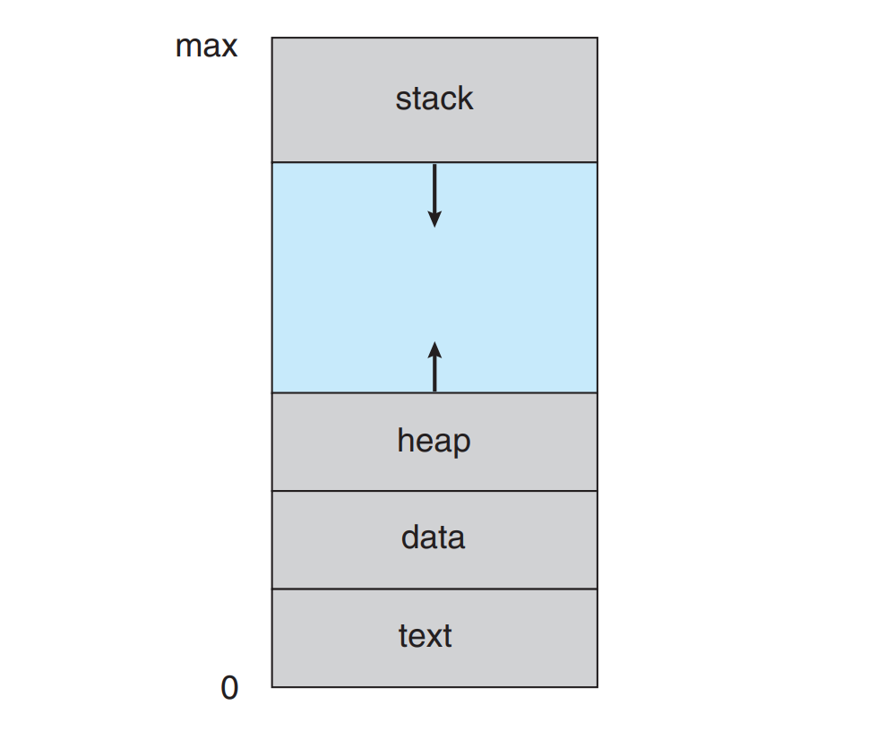

其中，进程的组成如下：

* 程序文本（text section）：包含着被顺序执行的程序指令集合
* 程序数据（data section）：包含程序执行过程所需的全局变量
* 进程活动（current activity）：包含当前进程的控制与状态信息
* 进程时栈（stack）：存储着当前进程在内存中存储的栈帧数据
* 进程堆栈（heap）：存储着当前进程运行时所分配的动态内存

其中，后三者的管理都由**进程控制块**负责，所以在某些计算机辅导书上，进程的组织可以被分为：进程控制块（PCB）、文本段、数据段。

### 进程控制块PCB

在多道程序操作系统中，用一张进程表来实现进程模型，其中每一项对应着一个进程。自进程创建之初，就有唯一与之对应的**进程控制块**（[Process Control Block](https://en.wikipedia.org/wiki/Process_control_block#Structure)，[PCB](https://en.wikipedia.org/wiki/Process_control_block#Structure)），存储着有关这个进程的所有重要信息。如下是PCB的部分字段：

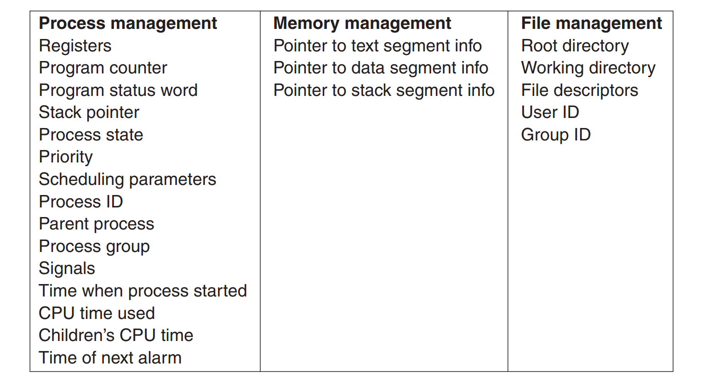

> 可以说，创建进程，实质上就是初始化PCB；撤销进程，实质上就是回收其PCB。
>

所以，可以认为某个进程都可以映射到PCB数据结构中，它一般包含：

* 进程标识数据：标识当前进程、父子进程与用户相关的 $\text{ID}$ 信息
* 进程状态数据：定义单个进程被挂起时需要保存的全部运行数据
* 进程控制信息：包括操作系统用来进行进程管理的所有控制信息

下面对上述三个范畴的数据进行更详细的描述：

#### 进程标识数据

进程标识数据包含进程标识（即 $\text{PID}$），在多道程序系统下，还包括 父进程$\text{PID}$、用户标识$\text{UID}$ 和 用户组标识$\text{GID}$ 等标识数据。其中，进程$\text{PID}$尤为重要，因为经常作为进程标识索引使用。

#### 进程状态数据

在多道程序系统下，多进程之间交替执行，经常会发生切换长下文环境（[context switch](https://en.wikipedia.org/wiki/Context_switch)）的情况。中断发生时操作系统需要将当前进程的运行环境状态保存进入PCB，以便于在进程重新运行的时候来恢复进程原来的运行环境。保存的数据通常包括：

* [通用寄存器](https://baike.baidu.com/item/%E9%80%9A%E7%94%A8%E5%AF%84%E5%AD%98%E5%99%A8/283978)值（[wiki](https://en.wikipedia.org/wiki/Processor_register#GPR)）：进程执行运行态所使用的寄存器集合
* [地址寄存器](https://baike.baidu.com/item/%E5%9C%B0%E5%9D%80%E5%AF%84%E5%AD%98%E5%99%A8/3219619)值（[wiki](https://en.wikipedia.org/wiki/Memory_address_register)）：例如存在 $\text{SP}$、$\text{BP}$、$\text{MAR}$等的地址
* [控制寄存器](https://baike.baidu.com/item/%E6%8E%A7%E5%88%B6%E5%AF%84%E5%AD%98%E5%99%A8/9335215)值（[wiki](https://en.wikipedia.org/wiki/Control_register)）：包含控制与确定处理器模式的控制值
* [状态寄存器](https://baike.baidu.com/item/%E7%8A%B6%E6%80%81%E5%AF%84%E5%AD%98%E5%99%A8/2477799)值（[wiki](https://en.wikipedia.org/wiki/Memory_address_register)）：包含程序过程中系列条件状态码的值
* [程序计数器](https://en.wikipedia.org/wiki/Program_counter)值（[wiki](https://en.wikipedia.org/wiki/Program_counter)）：指向程序要运行的下一条指令的地址

> 对于**程序状态字**（[Program Status Word]()，**PSW**），它同时担任这 *状态寄存器*（[Status Register](https://en.wikipedia.org/wiki/Status_register)）和 *程序计数器*（[Program Counter](https://en.wikipedia.org/wiki/Program_counter)，**PC**）。
>

#### 进程控制数据

进程控制信息被操作系统用来管理该进程（进程有着较强的独立性和自我管理意识😄）。它主要包括：

* 进程状态转换：三个基本状态“就绪”“等待”“运行”相互转换
* 进程访问权限：包含当前进程对是否可以访问系统资源的权限信息
* 进程结构关系：当前进程的子进程$\text{ID}$列表或其他相关联的进程列表
* 进程间的通信：标志位 (flag) 、信号量 (signal) 和 消息 (message)
* 内存管理信息：进程占有的页表、段表 以及 动态分配的内存范围
* 进程资源信息：操作系统通过调度分配给当前进程的系统资源信息
  * CPU调度信息：当前进程参与调度所需要的优先级等信息
  * 文件描述符表：当前进程所访问的文件（包括 $\text{I/O}$ 设备）

## 进程状态与转换

进程执行过程中的事件可以触发其状态改变，用状态机图表示如下：

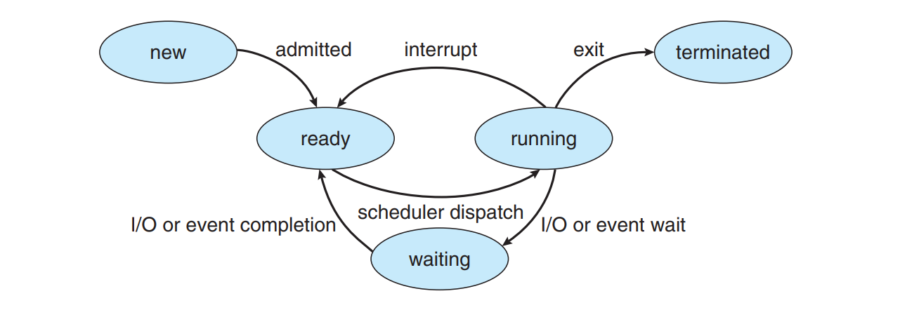

如上图所示，进程共有常见的五种进程状态：

* 新建态：进程（即程序控制块 PCB）正在被创建
* 运行态：其程序指令（Instruction）正在被执行
* 阻塞态：进程由于等待某些时间的发生而被阻塞
* 就绪态：进程等待着被分配给新的处理器来执行
* 终止态：进程由于某原因回收子进程并释放资源

因为新建的进程变为就绪态和运行态，结束的进程则是从所有关系中退出并释放资源。所以五种常见状态中只有三种状态有进程队列：**运行**、**阻塞**、**就绪**，所以称为进程的基本状态。如下是基本状态间的转换：

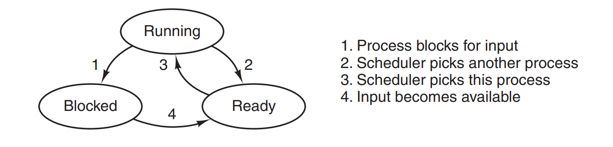

如上图所示，三种基本状态之间的转换关系如下：

* 运行态→阻塞态：比如进程请求资源这样等待某一条件受阻塞时转换
* 运行态→就绪态：处于运行态的进程时间片用完后，暂时让出处理器
* 就绪态→运行态：处于就绪态的进程通过调度得以分配到处理器资源
* 阻塞态→就绪态：阻塞事件（$\text{I/O}$结束或中断结束）结束后等待运行

## 进程结构与操作

进程在操作系统中是以表（数组）的形式存储的，但在创建进程之间的组织关系上，由于父子关系的存在，呈现的是一种树状结构。对于每一个运行中的结点进程，都可以操作进程的控制原语。

### 进程的组织结构

比较经典为Linux操作系统中的进程树，其部分树状图形架构表现如下：

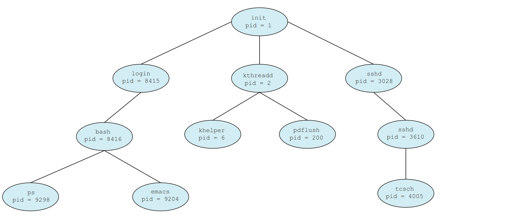

### 进程的控制原语

内核中对进程进行控制的系列操作，一般早操作系统中其程序作为原语使用。原语的特点就是执行过程中不允许中断，因此进程控制函数不可分割，相关原语如下：

1. 进程的创建（create）：由父进程创建可继承其资源的子进程
2. 进程的终止（abort ）：撤销进程及其子进程并回收进程资源
3. 进程的阻塞（block ）：进程的执行需等待某条件发生而阻塞
4. 进程的唤醒（awake）：阻塞进程等待条件满足是唤醒此进程
5. 进程的切换（switch）：处理机从某进程切换到另一进程运行

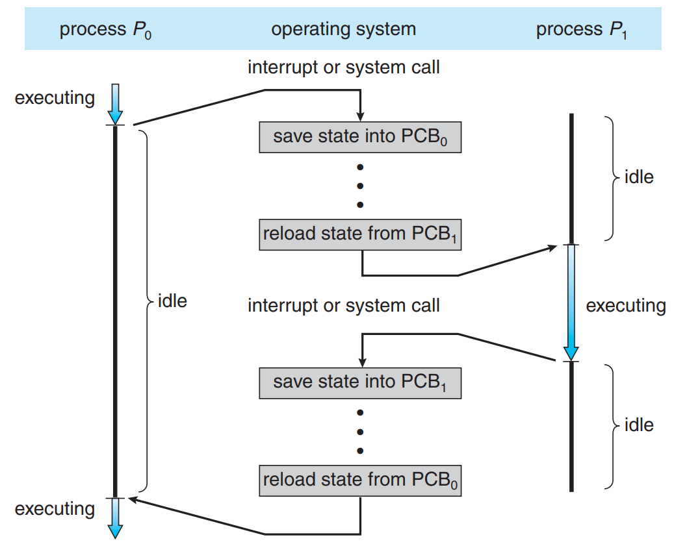

> 注意，进程调度与进程切换不同：进程的调度是操作系统根据优先级决定资源分配给哪个进程的行为，是决策行为；切换是指资源实际再分配的行为，是执行行为。一般来说，二者具有时间上的前后关系。
>

## 线程的基本概念

在传统操作系统中，多道程序基于进程调度资源与执行程序的结合。但由于跨进程之间的通信耗费较大，并发效率仍可提升；于是线程考虑尽可能减少上下文切换的时间消耗，从而进一步提高并发性能。

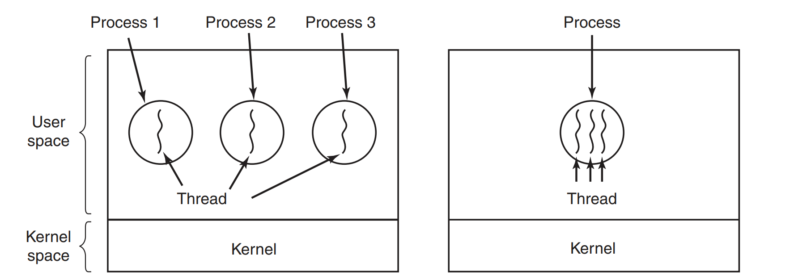

引入线程之后，线程成为程序执行流的最小单位，也可说是独立运行（或运算调度）的最小单位。线程的主要属性如下：

* 线程是轻量的，它不拥有系统资源，但是每个线程都会分配唯一标识符与线程控制块（[Thread Control Block](https://en.wikipedia.org/wiki/Thread_control_block)，[TCB](https://en.wikipedia.org/wiki/Thread_control_block)）
  > 线程控制块记录了线程执行的**寄存器**（如：PC）和**栈**等现场状态，类似于进程运行数据的最小运行时环境数据。
  >
* 不同线程可以执行相同的程序，即同一段服务程序被不同的用户调用时，操作系统把它们创建成不同的线程（即各自拥有PC与运行栈）
  > 新建Web浏览器一个标签页，或新建编辑器中一个文本框，本质上就是在进程中新创建一个线程
  >
* 同一进程可以包含不同的线程，各线程共享进程所拥有的资源。单条线程指的是进程中一条单一顺序的控制流。
  > 线程成为处理器的独立调度单位：单处理器下，进程中的各线程并发执行；多线程的处理器下，进程中的各线程可以并行执行。
  >
* 线程生命周期中也会有阻塞态、就绪态 和 运行态等状态变化。
  > 如今线程称为处理器独立调度的最小单位，而进程成为系统资源分配的最小单位。从被创建开始，各线程竞争进程资源并实现状态的不断转化，直到其生命周期结束。
  >

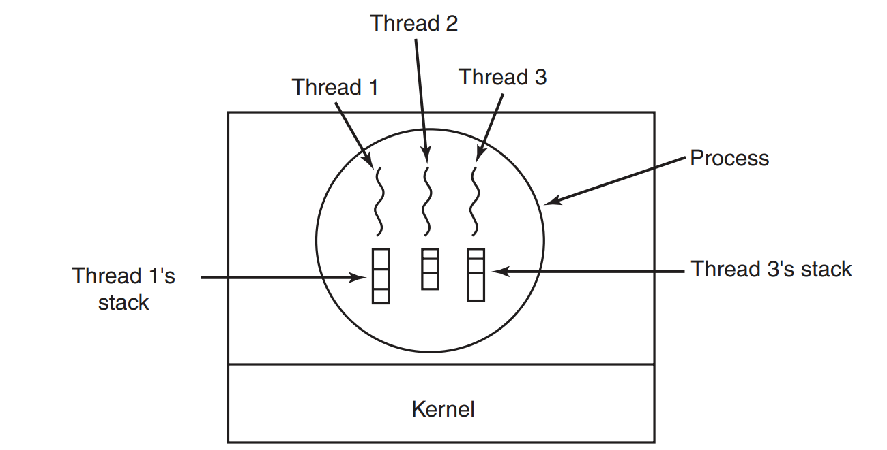

### 线程控制块

操作系统中同样用表结构管理线程，其中每单位表项结构即为**线程控制块**（[Thread Control Block](https://en.wikipedia.org/wiki/Thread_control_block)，[TCB](https://en.wikipedia.org/wiki/Thread_control_block)）。线程控制块中含有的主要信息包括：

* 线程标识符：分配给每个新创建的线程用来区分不同线程的特殊标识
* 栈指针：用来指向在内存中线程占有的运行栈。
* 程序计数器值：指向线程将要运行的当前程序的指令
* 线程状态：运行、就绪、阻塞、创建、终止
* 线程寄存器值：分配给线程的寄存器中的值
* 进程PCB地址：指向所属进程PCB的指针

> 线程数据包含了程序独立单一执行流所需的重要信息
>

### 线程的模型

根据[线程](https://baike.baidu.com/item/%E7%BA%BF%E7%A8%8B/103101)的实现位置，可以分为两类：用户级线程（[User-Level Thread](https://en.wikipedia.org/wiki/Thread_(computing)#N:1_(user-level_threading))，[ULT](https://en.wikipedia.org/wiki/Thread_(computing)#N:1_(user-level_threading))）和 内核级线程（[Kernel-Level Thread](https://en.wikipedia.org/wiki/Thread_(computing)#1:1_(kernel-level_threading))，[KLT](https://en.wikipedia.org/wiki/Thread_(computing)#1:1_(kernel-level_threading))），其中：

1. **用户级线程**：线程管理所有工作由**应用程序**完成，**内核无法意识到线程存在**。用户线程与内核可调度实体的关系为 $\text{N : 1}$ 的关系（多对一模型）。
   > 早期Linux操作系统实际上就是用这种方式支持线程，它所使用的线程库都需要支持POSIX规范，也就是实现PHTREAD线程库
   >
2. **内核级线程**：线程管理所有工作由**内核**完成，**应用程序通过线程接口创建线程**。一对一模型：内核线程本身可被内核调度，所以与内核可调度实体为 $\text{1 : 1}$ 的关系（一对一模型）。
   > Windows操作系统严格意义上是实现内核级线程的操作系统系统；现代操作系统多添加支持内核级线程的特性，包括Linux、Solaris。
   >

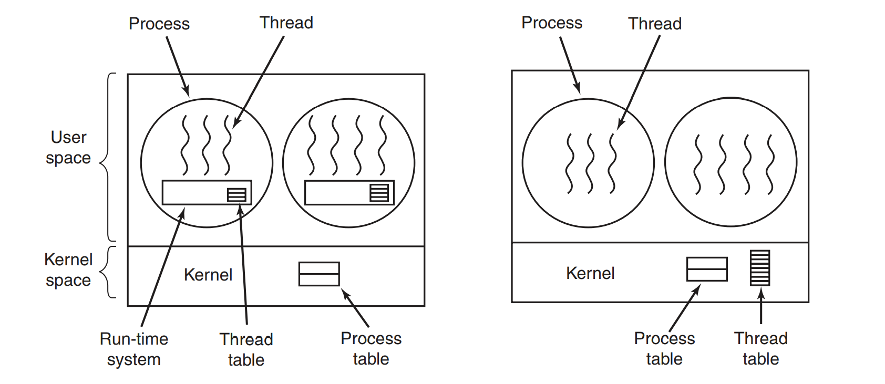

除上述两种实现方式之外，还有一种 $\text{M : N}$ 映射关系的**混合模型**（多对多模型，其中$\text{M >= N}$），它既实现了用户线程多对多映射到内核线程上去。

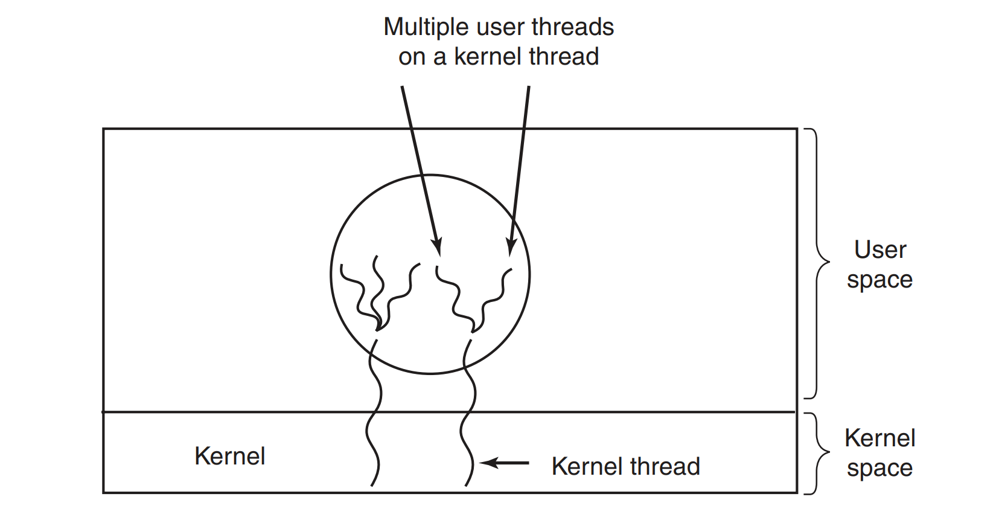

实现混合模型的常见操作系统如 Solaris（old than 9），实现内核级线程与用户级线程的多对多映射。

> 实际上，Solaris 9之前实现了两种 混合模型（many-to-many） 和 一对一模型（user-level），所以也称为二层模型（two-level model）；而从version 9开始，只实现一对一模型。
>

### 线程、进程与轻量级进程

引入线程后，进程的内涵发生了变化：进程只作为除CPU外的系统资源的分配单元，而线程则作为处理机的分配单元。由于单个进程内部可能有多个线程，若线程的切换发生在进程的内部，将会消耗较少的时空开销。

#### 线程与进程的比较

* **资源调度**
  1. 传统操作系统：进程是资源拥有的基本单位，同时是独立调度的基本单位。
  2. 线程操作系统：进程是资源拥有的基本单位；线程是$\text{CPU}$调度的基本单位。
* **系统资源**
  1. 进程是资源拥有基本单位，其资源具有独立性，需要跨进程通信交换数据
  2. 线程同一进程均可分配但不独立拥有进程资源，切换所需的时空开销更小
* **并发程度**
  1. 进程并发需要在传统操作系统下，完成进程间的上下文切换，耗费大
  2. 跨进程的线程并发耗费大；同一进程的线程并发耗费很小，通信量高
* **系统开销**
  1. 创造或撤销进程，都要都要分配或回收进程系统资源，开销大
  2. 创造或撤销线程，只需要分配或回收少量寄存器内容，开销小
* **通信手段**
  1. 进程间通信（$\text{IPC}$）借助进程同步和互斥手段来进行数据通信
  2. 线程间同行可以直接 读/写 数据段（如全局变量）来进行通信

#### 轻量级进程的概念

在某些语境下，线程被认为是“轻量级”的进程。在计算机操作系统的语境下，[轻量级进程](https://zh.wikipedia.org/zh-hans/%E8%BD%BB%E9%87%8F%E7%BA%A7%E8%BF%9B%E7%A8%8B)（[light-weight process](https://en.wikipedia.org/wiki/Light-weight_process)，[LWP](https://en.wikipedia.org/wiki/Light-weight_process)）被认为是实现多道程序的方法。它与进程、线程的比较如下：

* 与普通进程相比，LWP与其他进程共享所有（或大部分）它的逻辑地址和系统资源。
* 与线程相比，LWP有它自己的进程标识符，并且与其他的进程有着父子关系；并且与线程可以有用户、内核两种管理方式不同，LWP只能由内核管理且想普通进程一样被调度。

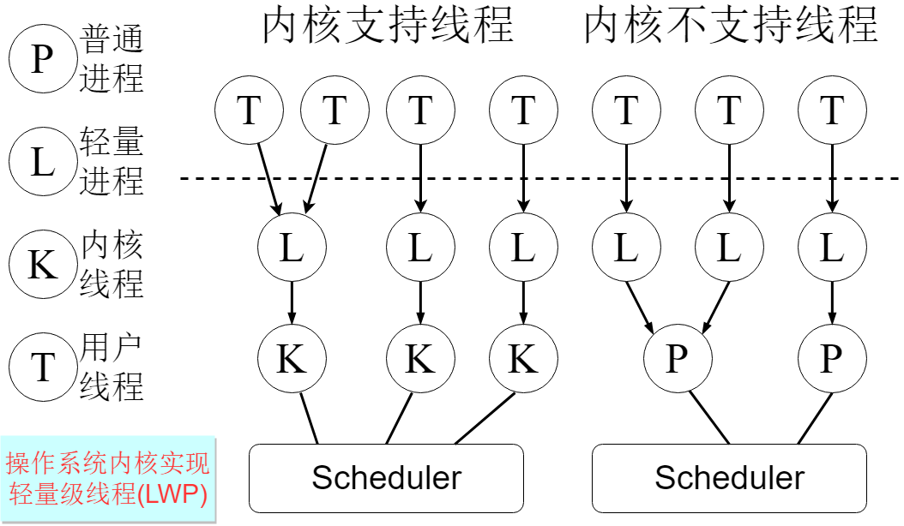

当然，轻量级进程属于进程与线程的过渡层。当内核不支持线程的时候，轻量级线程可以视作内核线程，方便的提供线程的实现；当内核支持线程时，一般作为内核线程提供应用程序实现用户线程的接口。