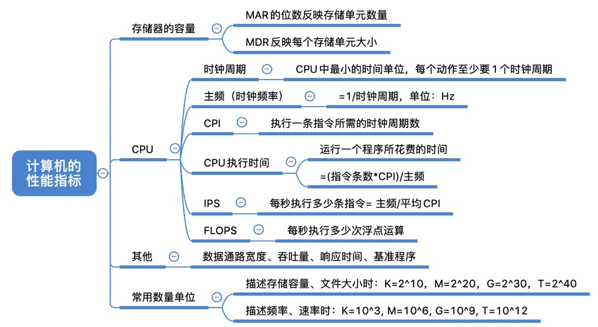

## CPU的性能指标

* **CPU时钟周期**：节拍脉冲或$T$周期，即主频的倒数
  > CPU中最小时间单位，执行指令每个动作至少需要1个时钟周期。
  >
* **CPU时钟频率**（**主频**）：机器内部主时钟的频率，是衡量机器速度的重要参数
  > 对于同一型号的计算机，主频越高，完成一个指令的执行步骤用时越短，执行指令速度越快。
  >
* **CPI**（Clock cycle Per Instruction）：执行单条指令所需要的时钟周期数
  > 不同指令的周期数显然可能不同，所以这里对于一个程序或者一台机器，CPI指该程序或该机器指令执行所需的平均时钟周期数。
  >
* **CPU执行时间**：执行程序耗时
  > $CPU执行时间 = CPU时钟周期数/主频 = (指令条数*CPI)/主频$
  >

  ?> **上式表明**：CPU的性能（CPU执行时间）取决于三个要素：主频、CPI 与 指令条数。
* IPS（Instructions Per Second）：每秒执行指令数
  > $IPS = 指令条数/执行时间 = 主频/加权平均CPI $
  >
* MIPS（Million IPS）：每秒执行百万条指令数
  > $MIPS = 指令条数 / (执行时间 × 10^6) = 主频/(平均CPI × 10^6)$
  >

  ?>  **注意**：MIIPS对比不同机器的性能比较是有缺陷的，因为机器的指令集不同，指令的粒度也不同。
  > 类比一下，假设两个人同样勤劳，在同等时间内完成同样辛苦的事情。一个人比较细致地将整件事细致地分成很多步骤（指令）完成，每个步骤都比较简单；另一个人将整个事情分成少量步骤（指令），每个步骤都比较困难。显然，这时前者同等时间完成的指令多于后者，但是二者性能是一样的。
  >
* **FLOPS**（Floating-point Operations Per Second）：每秒浮点运算数
  > KFLOPS、MFLOPS、GFLOPS、TFLOPS、PFLOPS、EFLOPS、ZFLOPS等
  >

## 存储器的性能指标

* **主存容量**：主存储器所能够存储信息的最大容量，通常用字节来衡量,也可用字数×字长，其中：
  * MAR（[Memeory Address Register](https://en.wikipedia.org/wiki/Memory_address_register)）：记忆位址寄存器，其位数对应反应存储单元总数（可寻址范围）。1
    > 可寻址范围并不一定是实际存储器的存储容量，虚拟主存技术的发展可以将硬盘上的部份视为内存进行使用，例如苹果swap分页。
    >
  * MDR（[Memeory Data Register](https://en.wikipedia.org/wiki/Memory_buffer_register)）：记忆数据寄存器，其位数反应单个存储单元的大小（存储字长）。

  > $总容量=存储单元数\ byte = 存储单元数 × 存储字长\ bit $
  >
  > 比如：MAR 为32位，MDR 为8位，总容量 = $2^{32}×8$ bit = 4 GB
  >

## 系统整体的性能指标

* **数据通路带宽**：数据总线一次所能并行传送信息的位数
  > 这里所说的数据通路带宽指的是外部数据总线的宽度（bit），他与CPU内部数据总线宽度（内部寄存器位数）有可能相同（😃俺觉得是略大于或等于）。
  >

?>  **注意**：各个子系统通过数据总线连接形成的数据传送路径称 为 数据通路。

* **吞吐量**：指系统在单位时间内处理请求的数量
  > 取决于 信息输入内存速度、CPU取指速度、数据存入存出速度、I/O速度。如今计算机基本全部被主存卡死😲，所以，现代计算机系统吞吐量主要取决于主存的存取周期。
  >
  > 所以Apple搞Soc想去解决这个卡脖子的问题，其实Intel等牙膏厂都想过方法去解决这种问题（因为问题就在那里（bushi），其实是主频实在挤不出水了😏）。
  >
* **响应时间**：指从用户向计算机发送一个请求，到系统对该请求做出相应并获得它所需要结果的等待时间。
  > 通常包括 CPU执行时间（运行程序花费时间） 与 等待时间（I/O操作等）。只是听定义有没有计网RTT的感觉hhh。
  >
* **基准程序**（benchmarks）：专门用来进行性能评价的一组程序，能够很好的反应机器在运行实际负载的性能。
  > bench mark，抽象点想象一下，明白了吧？🤔，不同的场合有着不同的基准程序。比如在机器学习场景下，benchmarks 对应的其实就是测试集；而在计算机性能评价上，评分软件类如鲁大中用来评分的程序就是基准程序。
  >

  ?> "基准程序"执行越快不一定代表机器某方面性能越好，因为他对不同语句存在频度差异，运行结果不能完全说明问题

## 知识总结回顾

