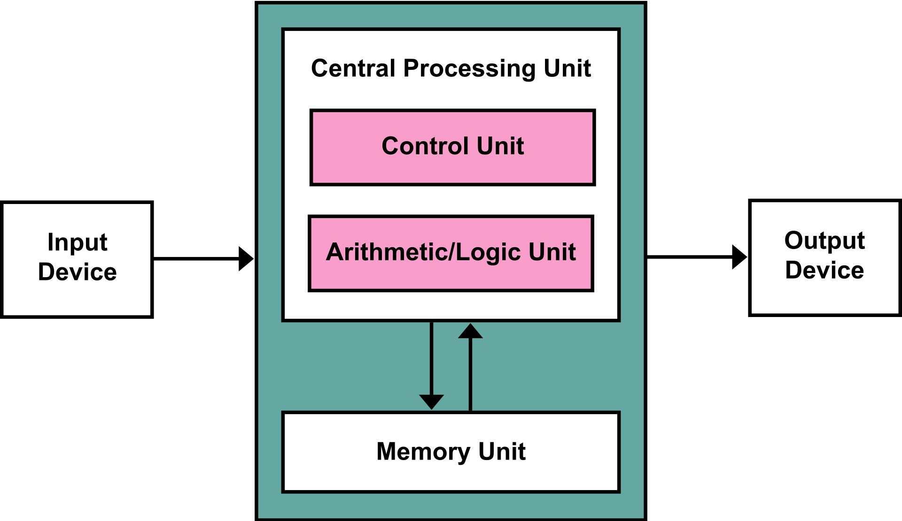
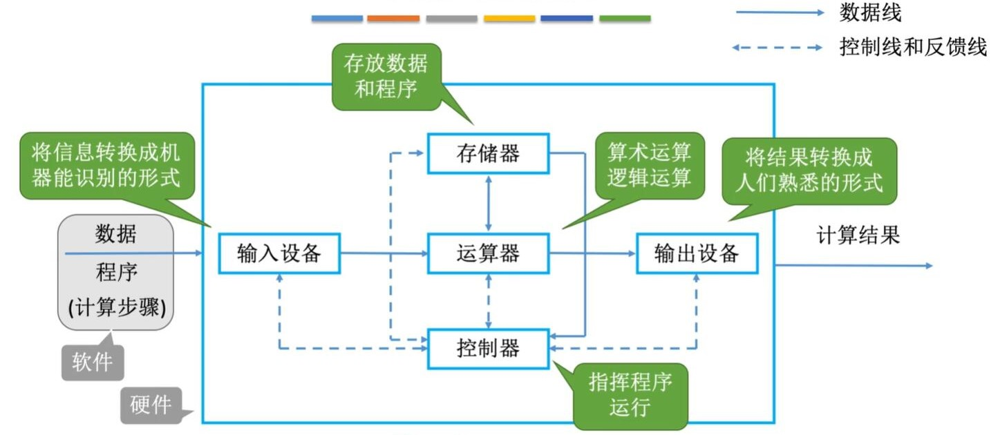
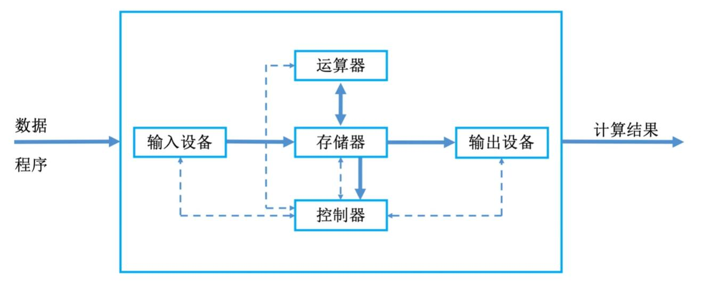
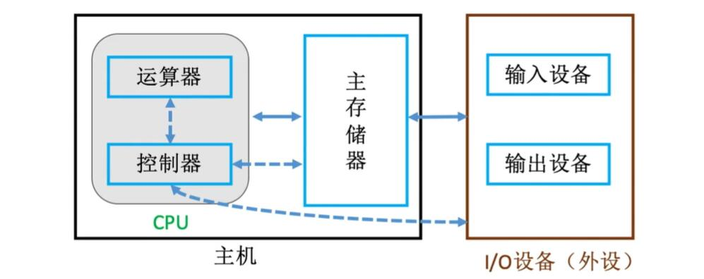
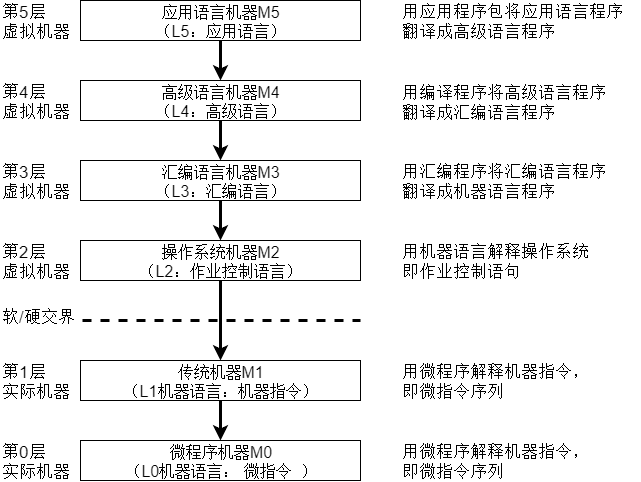
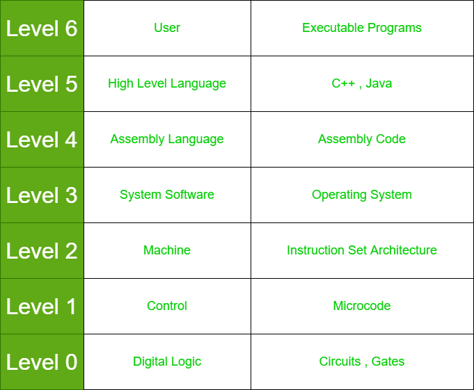
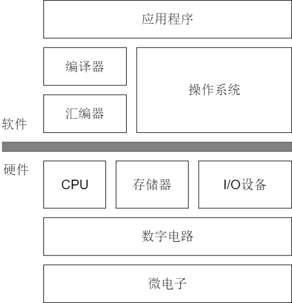

## 计算机系统的组成

硬件系统 和 软件系统 共同组成了一个完整的计算机系统.

* 硬件：有形的物理设备，是计算机系统中实际物理装置的总称
* 软件：硬件上运行的程序和相关数据的文档

## 硬件系统基本组成

计算机系统的硬件多种多样，早期有不少领域专家研究过基本组成结构，在这里我们主要研究 `早期经典冯诺依曼机` 与 `现代计算机` 的结构。

* **早期冯诺依曼计算机**
  冯诺依曼在研究在研究EDVAC时提出了“**存储程序**”的概念。存储程序的思想奠定了现代计算机的基本结构（[冯诺依曼架构](https://en.wikipedia.org/wiki/Von_Neumann_architecture)），以此概念为基础的各类计算机统称为 [冯·诺依曼机](https://zh.wikipedia.org/zh-hans/%E5%86%AF%C2%B7%E8%AF%BA%E4%BC%8A%E6%9B%BC%E7%BB%93%E6%9E%84)。
  > * “存储程序”的该概念是指将指令以代码的形式实现输入计算机的主存储器，然后按照存储器的首地址执行第一条指令，以后按照规定顺序执行其他指令。
  > * 实际上，冯诺依曼结构计算机只是[存储程序计算机](https://en.wikipedia.org/wiki/Stored-program_computer)的一种实用实现，实际上还有其他存储计算机的实现，比如[哈佛结构计算机](https://en.wikipedia.org/wiki/Harvard_architecture)。
  >

  
  其早期文档描述的结构如下：
  * [处理器](https://baike.baidu.com/item/%E4%B8%AD%E5%A4%AE%E5%A4%84%E7%90%86%E5%99%A8/284033)（[PU](https://en.wikipedia.org/wiki/Central_processing_unit)）：包含 [算数逻辑单元](https://baike.baidu.com/item/%E7%AE%97%E6%9C%AF%E9%80%BB%E8%BE%91%E5%8D%95%E5%85%83/8954657)（[ALU](https://en.wikipedia.org/wiki/Arithmetic_logic_unit)）与[处理器寄存器](https://en.wikipedia.org/wiki/Processor_register)
  * [控制器](https://baike.baidu.com/item/%E6%8E%A7%E5%88%B6%E5%99%A8/2206126)（[CU](https://en.wikipedia.org/wiki/Control_unit)）：包含 [指令寄存器](https://baike.baidu.com/item/%E6%8C%87%E4%BB%A4%E5%AF%84%E5%AD%98%E5%99%A8/3219483)（[IR](https://en.wikipedia.org/wiki/Instruction_register)） 与 [程序计数器](https://baike.baidu.com/item/%E7%A8%8B%E5%BA%8F%E8%AE%A1%E6%95%B0%E5%99%A8)（[PC](https://en.wikipedia.org/wiki/Program_counter)）。
  * [存储器](https://baike.baidu.com/item/%E5%AD%98%E5%82%A8%E5%99%A8)（[Memory](https://en.wikipedia.org/wiki/Computer_memory)）：也称内存，用来存储 [数据](https://baike.baidu.com/item/%E6%95%B0%E6%8D%AE/5947370)（[data](https://en.wikipedia.org/wiki/Data_(computing))） 与 指令（[Instruction](https://en.wikipedia.org/wiki/Instruction_set_architecture)） 。
  * [输入输出设备](https://baike.baidu.com/item/%E8%BE%93%E5%85%A5%E8%BE%93%E5%87%BA%E8%AE%BE%E5%A4%87/8166762)（[I/O](https://en.wikipedia.org/wiki/Input/output)）与 外部[大容量存储](https://baike.baidu.com/item/mass%20storage/4704444)（External [Mass Storage](https://en.wikipedia.org/wiki/Mass_storage)）

  > 后来，冯诺依曼结构代指任何 **指令** 与 **数据** 同等地位存储的存储程序计算机，如下图：
  >

  
  其普遍特点如下：
  1. 计算机硬件由 **运算器**、**存储器**、**控制器**、**输入设备**与**输出设备**，共5大部份组成。
  2. **指令**和**数据**均用二进制码表示，以**同等地位**存储在存储器中，可按地址寻访
  3. 指令由**操作码**和**地址码**组成，操作码指出操作的类型，地址码指出操作数的地址
  4. 指令在存储器内按照**顺序**存放。通常指令是顺序执行的，特定条件下可根据运算结果与设定条件改变顺序（jmp 😃）。
  5. 早期的冯诺依曼运算器为中心，输入输出设备通过运算器与存储器传输数据。
* 现代计算机组织结构
  
  在微处理器问世之前，运算器与控制器分离，而且存储器的容量很小，因此设计成以运算器为中心的结构；而现代由于大量I/O设备与CPU速度差距悬殊，计算机已发展成以存储器为中心，使得I/O操作可以尽可能绕过CPU，直接在I/O设备与存储器中进行。
  
  > 目前，绝大多数现代计算机仍遵循 冯·诺依曼架构存储程序计算机的基本思想（存储程序、数据指令同等地位存储 但以 存储器 为中心）
  >
* 计算机的功能部件
  传统冯诺依曼计算机与现代计算机尽管结构有所不同，但是功能部件是一致的，都包含五大部分：
  1. 输入设备：将程序和数据以及其能够识别和接收的信息形式输入计算机
  2. 输出设备：将计算机处理结果以人能接收或其他系统要求的信息形式输出
  3. 存储器：作为计算机存储部件，用来存放程序和数据
  4. 运算器：作为计算机执行部件，用来进行算数与逻辑运算
  5. 控制器：作为计算机控制中心，用来调度各计算机元件协调工作

## 计算机系统的多级层次结构

> 计算机层级结构可以从不同的角度进行划分，如上是从计算机设计者的角度而言，从设计者角度还有相似但是不同的划分：
>
> 
>
> 从使用者角度，计算机是由硬件与软件组成的，而软件进一步由 系统软件和应用软件组成。
>
> 
>
> 这种划分非抽象机器层次的划分，而是按照更加真实的划分层次。上述两种划分的区别类似于在计算机网络中 OSI的7层架构 与 TCP/IP 协议的实际结构🦌 。
>