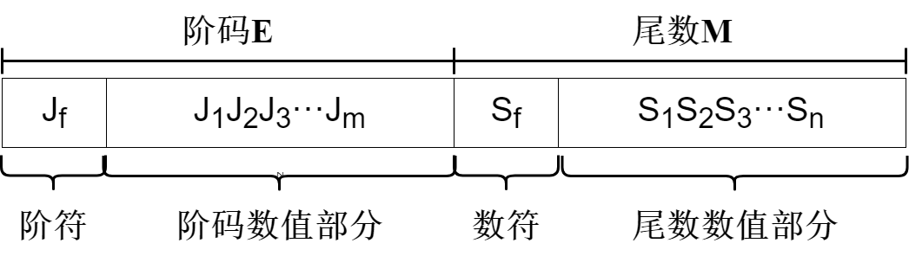

## 定点数浮点数

根据小数点位置是否固定，在计算机中有着两种数据格式：定点表示、浮点表示。

* 定点表示：约定机器数中的小数点位置固定不变
  > y类比：小数点位置固定	Eg: 996.007		——常规计数法
  >
* 浮点表示：以适当的形式将比例因子表示在数据中，让小数点的位置根据需要而浮动
  > 类比：小数点位置浮动	Eg: 0.96007×$10^2$	——科学计数法
  >

## 定点数的表示

定点表示即约定机器数中的小数位置是固定不变的，小数点不再使用 "." 表示而是约定它的位置。

### 定点小数、定点整数

理论上，小数点的位置可以固定任何一位，但在计算机中通常采用两种简单的约定：

* 定点小数：小数点固定在符号位之后，有效数值部分最高位之前。
* 定点整数：小数点固定在有效数值部分之后。

> 下面画图的时候添加上了符号位，但是实际上定点数并不一定会有符号位，这里只是表示相对位置关系
>

#### 定点小数

定点小数就是纯小数，约定小数点位置在符号位之后、有效数值部分最高位之前。若数据的形式为 $X=x_0x_1x_2···x_n$（其中，$x_0$为符号位， $x_1 $\~$x_n$是有效数值部分，也称尾数，其中 $x_1$为最高有效位）

> 当$x_0=0$，$x_1 $\~$x_n$ 均为 1时，$X$为其所能表示的最大正数，真值等于 $1-2^{-n}$；
>
> 当 $x_0=1$，$x_1 $~$x_n$均为 1时，$X$为其所能表示的最小负数，真值等于$2^{-n}-1$。
>

#### 定点整数

定点整数就是纯整数，约定小数点位置在有效数值部分最低位之后。若数据的形式为 $X=x_0x_1x_2···x_n$（其中，$x_0$为符号位， $x_1 $\~$x_n$是有效数值部分，也称尾数，其中 $x_n$为最低有效位）

> 当$x_0=0$，$x_1 $\~$x_n$ 均为 1时，$X$为其所能表示的最大正数，真值等于 $2^n-1$；
>
> 当 $x_0=1$，$x_1 $~$x_n$均为 1时，$X$为其所能表示的最小负数，真值等于$1-2^n$。
>

### 无符号数、有符号数

根据有无符号位可以将在计算机中参与运算的机器数分成两个大类：无符号数、有符号数

#### 无符号数

整个机器字长的全部二进制为数值值，没有符号位，相当于数的绝对值

> 通常无符号数只会表示整数，而不会用来表示小数；若机器字长为 n 为，则无符号数的表示范围为 $ [0 , 2^n-1]$。
>

#### 有符号数

将二进制数的最高位作为符号位，将符号放在有效数字的前面来代表正负

> 通常用 "0"，作为最高位的正；用 "1"，作为最高位的负。
>

有符号数的机器表示有：原码、补码、反码 和 移码。

> 为了能正确区别真值和各种机器数，约定用 $X$ 来表示真值，用 $[X]_{原}$表示原码，用$[X]_{补}$表示补码，用$[X]_{反}$表示反码，用$[X]_{移}$表示移码。
>
> 
>

##### 有符号数处理

数学中，任意基数的负数都在都在最前面加上 "-" 符号来表示。然而在计算机硬件中，数字都以无符号的二进制形式表示，因此，需要一种编码负号的方法。当前扩展二进制数字系统的方法有四种，用来表示符号数：

###### 原码（sign & magnitude，符号及值）

简单直观的机器数表示法，机器数的最高位表示该数的符号，其余各位为二进制表示的绝对值。

###### 反码（ones' complement）

若符号位为 0，则反码与原码相同；若符号位为 1，则数值位为原码全部取反。

> 反码通常用来作为由原码求补码或者由补码求原码的中间过渡
>

###### 补码（two's complement）

若符号位为 0， 补码与原码的表示相同，即$[x]_{补}=[x]_{原}$；若符号位为 1，原码符号位不变，数值部分按照位取反，末位加1。

> 即取反加一，此规则同样适用于由补求原
>

纯小数的补码定义：

$$
[x]_{补}=\begin{cases}  
x  & 1\gt x \geqslant 0 \\
2+x=2-|x| & 0 \gt x\geqslant -1
 \end{cases}
(mod\ 2)
$$

纯整数的补码定义：

$$
[x]_{补}=\begin{cases}  
x  			& 2^n\gt x \geqslant 0 \\
2^{n+1}+x=2^{n+1}-|x| 	& 0 \gt x\geqslant -2^n
 \end{cases}
(mod\ 2)
$$

> 从这个定义可以对比与移码之间的关系：符号位取反
>

TIPS：如果由$[x]_{补}$求$[-x]_{补}$的方法：符号位、数值位全部取反，最后末位加1。

###### 移码（offset binary，excess-N）

在真值$X$上加一个常数（偏置值），通常这个常数取$2^n$，相当于$X$在数轴上向正方向偏移了若干个单位，这就是“移码”一词的由来。其定义为：

$$
[x]_{移}=2^{n-1}+x\ （2^{n-1}\gt x \geqslant -2^{n-1}，其中机器字长为n）
$$

移码具有以下特点：

1. 只能表示**整数**。
2. 移码中零的表示唯一：$[+0]_{移}=2^{n-1}+0=2^{n-1}-0=[-0]_{移}$
3. 一个真值的移码（偏置为 $2^{n-1}$）和补码仅差一个符号位，$[x]_{补}$的符号位取反即得$[x]_{移}$
   > 可以与上面对比与整数补码之间的关系：[Here](#补码（two's complement）)
   >
4. 移码全0时，对应真值最小值$-2^n$；移码全1时，对应真值最大值 $2^n-1$
5. 移码保持了数据原有的大小顺序，移码大真值就大，移码小真值就小
   > 方便硬件实现上判断数字大小
   >

## 定点数的运算

定点数上定义着不同的运算方式，其同样对应着不同的操作对象。按照运算方式可以分为：移位运算、加减运算、乘法运算  和 除法运算。

### 移位运算

定点数的移位运算根据操作对象的不同分为算术移位和逻辑移位：对于有符号数的移位运算为算术移位，对于视操作数为无符号数的移位运算为逻辑移位。

#### 算术移位

算术运算的操作对象是有符号数，在移位过程中符号位保持不变。

1. 正数：空位添补 0
2. 负数：根据码制变化
   * 原码：空位添补 0
   * 反码：空位添补 1
   * 补码：右移添补 1，左移添补0

#### 逻辑移位

逻辑移位将操作数视为无符号数，移位规则：

* 逻辑左移时，高位移丢，低位添 0
* 逻辑右移时，低位移丢，高位添 0

#### 循环移位

循环移位分为：

* 带进位标志位的CF的循环移位（大循环）
* 不带进位标志位CF的循环移位（小循环）

主要特点：移入的数据又被移入数据中，是否带进位则要看是否将进位标志位加入循环位移：

 不带进位位的循环右移") 不带进位位的循环左移")

 带进位位的循环左移") 带进位位的循环右移")

> 循环移位操作适合用于将数据的低字节数据和高字节数据的互换
>

#### 符号扩展

比如将定位书表示的数转换成具有不同位数的某种形式。

* 正数
  所有码制都是原有符号位放到新的符号位上，然后添加的位用0填充。
* 负数
  1. 原码：符号位放到新的符号位上，然后新添位用 0 填充
  2. 反码：符号位放到新的符号位上，然后新添位用 1 填充
  3. 补码：
     * 整数：符号位放到新的符号位上，然后新添位用1填充（左）
     * 小数：符号位放到新的符号位上，然后新添位用0填充（右）

> 其实，也可以由高位向低位转换，是直接舍弃精度截取数值位的行为。
>

### 加减运算

定点数的加减运算主要分为原码和补码的加减法，相对其他运算比较简单。

学习视频：

<iframe src="https://player.bilibili.com/player.html?aid=70211798&amp;bvid=BV1BE411D7ii&amp;cid=223420654&amp;page=17" data-src="//player.bilibili.com/player.html?aid=70211798&amp;bvid=BV1BE411D7ii&amp;cid=223420654&amp;page=17" scrolling="no" border="0" frameborder="no" framespacing="0" allowfullscreen="true" style="width: 540px; height: 367px;"> </iframe>

#### 原码加减法

* 加法：
  1. 正+正 => 绝对值做加法，结果为正
  2. 负+负 => 绝对值做加法，结果为负
  3. 正+负 => 绝对值大的减绝对值小的，符号同绝对值大的数
* 减法
* 1. 正 -负 => 正+正
  2. 负 -正 => 负+负
  3. 正 -正 => 正+负
  4. 负+正 => 负 -负

#### 补码加减法

现在不用考虑符号位，对真值取补码，而后直接进行二进制的加法，之后再将补码。（变换都是取反加一）

$$
[A+B]_{补}  = [A]_{补}+[+B]_{补}  \\
[A-B]_{补} = [A]_{补}+ [-B]_{补}  \\
$$

> 这样在实现计算机硬件的时候就可以只实现加法器，然后就能完成加减法
>

#### 溢出概念与判断

溢出概念：溢出是指运算结果超过数的表示范围。

* 上溢：正+正=负
* 下溢：负+负=正

> 不同符号之间的加法必然不会溢出，😃我觉得不用具体说明。
>

溢出判断：

1. 溢出位的真假判断逻辑表达式：$V=A_SB_S\overline{S_S}+\overline{A_S}\overline{B_S}S_S$
   > $A_S$与$B_S$代表$A$与$B$两个数字的符号位的值，$S_S$则是进行补码加法和后符号位的值。
   >
2. 符号位的进位$C_S$ 与 最高位数值位的进位的异或：$V=C_S\oplus C_1$
   > 表示逻辑是：
   >
   > * 对于正+正=负：如果发生上溢，则必然发生最高数值位的进位而无符号位的进位。
   > * 对于负+负=正：如果发生下溢，则必然发生符号位的进位而无最高数值位的进位。
   > * 对于正+负：如果结果为正，则必然有符号位的进位和最高数值位的进位；如果结果为负，则必然无符号位的进位和最高数值位的进位。
   >
3. 双符号位：正数符号位为00，负数符号位为11。对结果符号位$S_{S1}S_{S2}$，有逻辑真值表达式$V=S_{S1}\oplus S_{S2}$。
   > 双符号位其实六十利用增加的符号位来逮捕单符号位的进位，从而根据结果判断是否溢出。并且有：
   >
   > 1. $S_{S1}S_{S2}=00$，结果正数，无溢出
   > 2. $S_{S1}S_{S2}=01$，结果负数，正溢出
   > 3. $S_{S1}S_{S2}=10$，结果正数，负溢出
   > 4. $S_{S1}S_{S2}=11$，结果负数，无溢出
   >

### 乘法运算

在计算机中，乘法计算由累加器和右移操作实现。根据机器数的不同，可以分为 原码一位乘法 和 补码一位乘法。

#### 原码一位乘法

实现原理：原码一位乘法的特点时符号位与数值位是分开求的 ：乘积符号位由两个数的符号位“异或”得来，乘积数值位则是两个数绝对值的乘积。

学习视频：

<iframe src="https://player.bilibili.com/player.html?aid=70211798&amp;bvid=BV1BE411D7ii&amp;cid=223421317&amp;page=18" data-src="//player.bilibili.com/player.html?aid=70211798&amp;bvid=BV1BE411D7ii&amp;cid=223421317&amp;page=18" scrolling="no" border="0" frameborder="no" framespacing="0" allowfullscreen="true" style="width: 534px; height: 385px;"> </iframe>

对$[X]_{原}=x_s.x_1x_2···x_n$，$[Y]_{原}=y_s.y_1y_2···y_n$，运算规则：

1. 被乘数和乘数均取绝对值参与运算，符号位为$x_s\oplus y_s$ 。
2. 部分积的长度等同于被乘数 取 $n+1$ 位，初始值为 0 。
3. 从乘数的最低位 $y_n$ 开始判断：
   * 若 $y_n=1$，则部分积加上被乘数，然后右移一位
   * 若 $y_n=0$，则部分积加上数值零，然后右移一位
4. 重复步骤 3，判断 $n$ 次（乘数数值部份位数）。

> ACC：累加寄存器    ：乘法中存取高位部分积
>
> MQ ：乘商寄存器    ：乘法中存取低位部分积与乘数
>
> X     ：操作数寄存器 ：存取被乘数
>

**手动计算原码一位乘法过程示例：**

设机器字长为 5 位（含有 1 位符号位，$n=4$），$x=-0.1101, y=+0.1011$，乘法用原码一位乘法的求解过程如下：

符号位 $P_s=x_s\oplus y_s =1 \oplus 0 = 1$，得 $x·y=-0.10001111$。

> 其实这里使用一位符号位就可以防止溢出，不过由于补码方法需要两位，为了统一选择都采用两位的符号位。
>

#### 补码一位乘法

实现原理：补码的一位乘法（Booth算法）是一种有符号数的乘法，采用相加和相减操作计算补码数据的乘积。

学习视频：

<iframe src="https://player.bilibili.com/player.html?aid=70211798&amp;bvid=BV1BE411D7ii&amp;cid=223421128&amp;page=19" data-src="//player.bilibili.com/player.html?aid=70211798&amp;bvid=BV1BE411D7ii&amp;cid=223421128&amp;page=19" scrolling="no" border="0" frameborder="no" framespacing="0" allowfullscreen="true" style="width: 541px; height: 386px;"> </iframe>

对$[X]_{原}=x_s.x_1x_2···x_n$，$[Y]_{原}=y_s.y_1y_2···y_n$，运算规则：

1. 符号位参与运算，运算的数均以补码表示
2. 被乘数一般取双符号参与运算，部分积取双符号位，初值为0，乘数可取单符号位。
3. 乘数末位增添附加位 $y_{n+1}$，且初值为 0。
4. 根据$(y_n, y_{n+1})$确定操作（$y_n$高位，$y_{n+1}$低位）：
   | $y_n$(高) | $y_{n+1}$(低)  | 操作                        |
   | ------- | ----------- | --------------------------- |
   | 0       | 0           | 部分积右移一位              |
   | 0       | 1           | 部分积加   $[X]_补$，右移一位 |
   | 1       | 0           | 部分积加$[-X]_补$，右移一位   |
   | 1       | 1           | 部分积右移一位              |

   > 此处的移位应当按照补码的移位规则进行
   >
5. 按照上述算法进行 $n+1$ 步操作，但是第 $n+1$ 步不再移位
   > （共进行 $n+1$ 次累加 和 $n$ 次右移），仅根据 $y_n$ 和 $y_{n+1}$的比较结果做相应的运算
   >

**手动计算补码一位乘法过程示例：**

设机器字长为 5 位（含有 1 位符号位，$n=4$），$x=-0.1101, y=+0.1011$，采用Booth算法的求解过程如下：

解：$[x]_补=11.0011，[-x]_补=00.1101，[y]_补=0.1011$。Booth求解过程如下：

所以$[x \cdot y]=1.01110001$，得$x\cdot y = -0.10001111$。

> TODO：更深一步得原理待定
>

### 除法运算

在计算机中，除法运算可转换成“累加-左移”（逻辑左移），根据机器数的不同，可分为原码除法和补码除法。

> 这里的除法区分于$\text{CRC}$码的模二除法，是单纯的算数除法，也就是说需要借位。
>

#### 原码除法运算

学习视频：

<iframe src="https://player.bilibili.com/player.html?aid=70211798&amp;bvid=BV1BE411D7ii&amp;cid=223421785&amp;page=20" data-src="//player.bilibili.com/player.html?aid=70211798&amp;bvid=BV1BE411D7ii&amp;cid=223421785&amp;page=20" scrolling="no" border="0" frameborder="no" framespacing="0" allowfullscreen="true" style="width: 577px; height: 392px;"> </iframe>

原码除法运算有恢复余数法与不恢复余数法（加减交替法），其中主要使用的是不恢复余数法。原码除法的特点是商符和商值是分开进行的，商符由两个操作数的符号位“异或”形成。

设 被除数 $[X]_原=x_s.x_1x_2···x_n$，除数$[Y]_原=y_s.y_1y_2···y_n$，则

1. 商的符号：$Q_s=x_s\oplus y_s$
2. 商的数值：$|Q|=|X|/|Y|$

##### 恢复余数法

原码的除法可以采用笨笨的恢复余数法，虽然会显得计算机很呆😄。

其中，求$|Q|$的规则如下：

1. 默认确定的最后一位商为1，原码做减操作，即加上除数绝对值负数的补码 $[-|y|]_补$。
2. 如果得到的结果符号为负，则说明余数小于被除数，加上除数绝对值的补码 $[|y|]_补$；商变为0。
3. 余数左移一位，继续开始步骤1。
4. 左移 $n$ 次（除数位数），上商$n+1$次后停止。最后一次上商余数不再左移。

> 注意事项：
>
> 1. 原码的所有计算符号位都取一位，计算开始之前取绝对值，符号位单独处理。
> 2. 移位过程中采用补码的逻辑移位，即最高位也进行移位，末尾补0。
> 3. 上商的次数一定是移位次数+1，且取结果时要丢掉最高位0
> 4. 这里要讲的是，任何能进行的除法第一位一定是0，否则当作**溢出**处理，不进行除法；如果第一步为1，硬件会直接停止运算。
>

###### 原码除法恢复余数法逻辑图

###### 计算机实现硬件细节

###### 计算原码一位除法（恢复余数法）过程示例

设机器字长为 5 为（含1位符号位，$n=4$），$x=0.1011$，$y=0.1101$，采用原码恢复余数法求 $x/y$。

解：首先求得 $|x|=0.1011，|y|=0.1101，[|y|]_补=0.1101，[-|y|]_补=1.0011$

##### 不恢复余数法（加减交替除法）

原码的除法主要采用不恢复余数法，也称原码加减交替除法。

> 在观察恢复余数法的过程中，我们发现，恢复余数的过程可以由余数左移再加除数的过程等效替代。从而得到不恢复余数方法。由于不恢复余数余数正负都要移动，电路逻辑上比恢复余数简单。
>

其中，求$|Q|$的规则如下：

1. 先用被除数减去除数$|X|-|Y|=|X|+[-|Y|]_补$得到余数
2. 对新得到的余数进行判断：
   * 当余数为正时，商上1，余数和商左移一位，余数减去除数
   * 当余数为负时，商上0，余数和商左移一位，余数加上除数。
3. 第$n+1$步余数为负时，需加上$|Y|$得到第$n+1$步正确的余数，余数需与被除数同号。

###### 原码加减交替法除法逻辑图

###### 计算原码一位除法（恢复余数法）过程示例

设机器字长为 5 为（含1位符号位，$n=4$），$x=0.1011$，$y=0.1101$，采用原码加减交替法求 $x/y$。

解：首先求得 $|x|=0.1011，|y|=0.1101，[|y|]_补=0.1101，[-|y|]_补=1.0011$

#### 补码除法运算

学习视频：

<iframe src="https://player.bilibili.com/player.html?aid=70211798&amp;bvid=BV1BE411D7ii&amp;cid=223421651&amp;page=21" data-src="//player.bilibili.com/player.html?aid=70211798&amp;bvid=BV1BE411D7ii&amp;cid=223421651&amp;page=21" scrolling="no" border="0" frameborder="no" framespacing="0" allowfullscreen="true" style="width: 629px; height: 437px;"> </iframe>

补码一位除法的特点是，符号位与数值位一起参与运算，商符自然形成：

1. 除法第一步根据被除数和余数的符号决定是做加法还是减法。
2. 上商的原则根据余数和除数的符号位共同决定：
   * 同号上商“1”，余数左移一位，减去除数；
   * 异号上商“0”，余数左移一位，加上除数；
3. 最后一步恒置“1”
   > 有误差，但是方便硬件实现，且精度误差不超过 $2^n$。
   >

###### 计算补码加减交替法除法过程示例

设机器字长为 5 为（含1位符号位，$n=4$），$x=+0.1011$，$y=-0.1101$，采用补码加减交替法求 $x/y$。

###### 补码加减交替法除法逻辑图

###### 与原码加减交替法的对比

### 定点整数强制类型转换

在高级语言的过程中，经常还会出现强制类型转换，而它并不属于以上集中运算，这里讨论的是定点整数的强制类型转换。按照不同条件可以分为：

* **有符号数和无符号数的转换**
  位值保持不变，仅改变了解释这些位的方式
* **不同字长整数之间的转换**
  1. 由大字节到小字节：高位直接截断，低位直接赋值
  2. 由小字节到大字节：补充符号高位，保持位值相等

### 数据的存储和排列

存储数据的时候，通常用最低有效字节（LSB）和 最高有效字节（MSB）。

> 例如，在32位计算机中，一个$int$型的变量$i$的机器为 01 23 45 67H，其最高有效字节MAB=01H，最低有小字节LSB=67H
>

#### 大端法与小端法

根据数据中各字节在连续字节序列中的排序不同，可以采用两种方式：

* **大端方式**
  从最高有效字节到最低有效字节的方式存储，即有效最高字节位于字节低位
* **小端方式**
  从最低有效字节到最高有效字节的方式存储，即有效最低字节位于字节高位

举个栗子🌰，对于一个32bit四字节int型整数，<kbd>01 23 45 67H</kbd>，在大端法机器和小端法机器中的位于地址<kbd>0800H</kbd>的存储方式如图：

> 其中，现代计算机基本上采用字节编址，每个地址存放一个字节，地址字节顺序一般是由从左到右由低到高排列。
>
> * 大端模式：更加便于人类阅读，即从最高有效字节到最低有效字节
> * 小端模式：更加便于机器阅读，即从最低有效字节到最高有效字节
>

#### 边界对齐方式

对于机器字长为32位的计算机，数据以边界对齐的方式存放，半字地址一定是2的整数倍，字的地址一定是4的整数倍。这样的好处是：这样无论所存取的字节是字节、半字或字，均可以一次访存存取

> 边界对齐是一种用空间换时间的思想，在$\text{RISC}$中采用边界对齐，在$\text{CISC}$中则对于对齐与不对齐都支持。
>

> 边界不对齐由于没有填充，显而易见是有着更高的存储空间利用率，适合于存储空间比较珍贵的场景
>

## 浮点数的表示

由于定点数的表示范围是有限的，但我们不能无限制地增加数据长度。所以为了可以实现相同字节大范围的数据表示，可以用浮点数的格式进行表示。

> 可将浮点数与科学计数法对比，在一定精度（位数）下，可表示范围更大
>

类比科学计数法，浮点数真值：$\text {FTV}=M×r^E$，其中：

* 阶码：常用补码或移码表示的定点整数
* 尾数：常用原码或补码表示的定点小数

> 通过观察可以有以下结论：
>
> * 阶码 $\text E$ 反应浮点数的表示范围及小数点的实际位置
> * 尾数 $\text M$ 的数值部分位数 $n$ 反应浮点数的精度
> * 计算机内部存储浮点数时的基数通常取 $2$.
> * 基数越大，范围越大，精度变差（数变稀疏）
>

### 规格化浮点数

实际上，为了尽可能提高尾数精度，在存储的过程中会对**尾数**进行**规格化**，即**将尾数整体左移直至最高位为有效值**，有：

* **左规**：浮点数运算结果非规格化时，**尾数算数左移一位，阶码减一**
* **右规**：浮点数运算结果尾数溢出时，**尾数算数右移一位，阶码加一**

> 1. 原码表示的尾数规格化
>    * 正数：0.1×××···×的形式，最大值 0.111···1，最小值 0.100···0
>    * 负数：1.1×××···×的形式，最大值 1.100···0，最小值 1.111···1
> 2. 补码表示的尾数规格化
>    * 正数：0.1×××···×的形式，最大值 0.111···1，最小值 0.100···0
>    * 负数：1.0×××···×的形式，最大值 1.011···1，最小值 1.000···0
>

> 所以，编码过程中在浮点数运算时，发生正负下溢同样可能使得结果为0
>

**本节学习视频地址：**

<iframe src="https://player.bilibili.com/player.html?aid=70211798&amp;bvid=BV1BE411D7ii&amp;cid=223422981&amp;page=24" data-src="//player.bilibili.com/player.html?aid=70211798&amp;bvid=BV1BE411D7ii&amp;cid=223422981&amp;page=24" scrolling="no" border="0" frameborder="no" framespacing="0" allowfullscreen="true" style="width: 669px; height: 382px;"> </iframe>

### IEEE 754标准

在浮点数的表示中，不同机器阶码位数、尾数位数都可能不同，这样在传输过程中解析会造成很大的麻烦与问题。于是为了统一浮点数的标准表示，$\text {IEEE}$ 规定了**IEEE二进制浮点数算术标准**（ $\text{IEEE 754}$ ），这个标准定义了：

1. 浮点数的格式
2. 浮点数运算符
3. 四种舍入规则
4. 五种例外情况

> 上述与下面根据位划分根据[中文维基](https://zh.wikipedia.org/wiki/IEEE_754)的定义，对应的是$\text{IEEE 754-1985}$的[英文维基-1985](https://en.wikipedia.org/wiki/IEEE_754-1985#Extended_formats)词条，也可参考[英文维基-2019](https://en.wikipedia.org/wiki/IEEE_754)新给出的划分。下面只讨论浮点数格式问题，有关运算放到下面浮点数的运算讨论。
>

#### IEEE 754 浮点数的格式

二进制浮点数是以符号数值表示法的格式存储，有以下三部分组成：

* 符号位（sign bit）：存储浮点数的正负值（正0负1）
* 指数部分：存储浮点数的阶码，由**移码**实现
* 小数部分：存储浮点数的尾数，由定点小数**原码**实现

IEEE根据浮点数的位数，还给出以下的划分：

* 单精确度（32 bit，C语言关键字 $\text{float}$     实现）
* 双精确度（64 bit，C语言关键字 $\text{double}$ 实现）
* 延伸单精确度（43 bit++，普通场景很少使用）
* 延伸双精确度（79 bit++，通常以 80bit 实现）

那么接下来以$\text{IEEE 754}$浮点数标准中的32位模型来举例如下：

##### 浮点数数值

$\text{IEEE 754}$ 浮点数的真值（实际值），等于符号位（sign bit）乘以指数偏移值（exponent bias）再乘以分数值（fraction）

$$
value=(\text{sign})\ 2^{\text{exponent}-\text{bias}}×\text{fraction}
$$

> 示例图中计算过程如下：
>
> $$
> \begin{aligned}value&=+\ 2^{(01111100)_2-(01111111)_2}×(1.01)_2= 2^{(-11)_2} ×(1.25)_{10}\\ &=2^{-3}×1.25 =0.15625\end{aligned}
> $$
>
> 所以实例中浮点数表示的值为 $0.15625$。
>

###### 符号位

符号位为 $0$ 代表正数；符号位为 $1$ 代表负数。

###### 指数偏移值

指数部分为移码表示，即有 $移码=真值+偏置值(\text {bias})$。对于 $\text{IEEE 754}$标准下，若指数部分位长为 $n$ ，则偏置值取 $2^{n-1}-1$。

> 显然，真值相当于指数部分的移码减去偏置值：$指数真值=指数移码-偏置值(0\overbrace{111···11}^{n-1\ bit})$ 。
>
> 根据示例图中，有：$指数真值=01111100-01111111=(-11)_2=(-3)_{10}$
>

###### 分数值

$\text{IEEE 754}$ 浮点数标准下的尾数部分（分数值 fraction）同样以定点小数表示，但是隐藏最高位有可能不同：

* 在规格化浮点数情况下，分数隐藏最高有效位数字 $1$；
* 非规格化浮点数情况下，分数隐藏最高有效位数字 $0$；

> 关于规格化与非规格化浮点数定义在后面会提到，实例中指数阶码不放呢非全0，则说明为规格化正数，小数部分为 $(1.01)_2$ 。
>

##### 扩展格式

浮点数表示中，不仅可以表示一定范围的浮点数，而且可以表示几种特殊值。

| 表示         | 指数部分  | 小数部分                    |
| ------------ | --------- | --------------------------- |
| 零           | 0         | ±0                         |
| 非规格浮点数 | 0         | 非0（0~1）                  |
| 规约         | 1 ~ $2^n-2$ | 非0（1~2）                  |
| 无穷         | $2^n-1$     | 0（根据符号位可分为±无穷） |
| NaN          | $2^n-1$     | 非0                         |

## 浮点数的运算

### 浮点加减运算

浮点数的加减运算具有以下运算步骤：

1. 对阶：阶数较小的阶数向阶数较大的浮点数对齐阶数
2. 尾数加减（顶点）：规格化定点小数补码的加减法
3. 规格化：规格化浮点数加减运算结果（左规、右规）
   * 左规：尾数补码出现 0.0××（正）或者 1.10××（负）时，需要分别左规成0.1××（正）与1.0××（负）形式，阶码对应相减
   * 右规：发生溢出时，如果是双符号位，则 01.××或者10.××时，尾数右移一位，阶码加一
4. 舍入处理：向偶舍入、向零舍入、向上舍入、向下舍入
   * 向偶舍入：四舍六入五成双
     当舍去的位数不等于平均值，向最近的数舍入；
     当舍去的位数等于其平均值，舍入让最低位变成偶数
   * 向零舍入：舍入到更靠近零
   * 四舍五入：等于平均值进位（round）
   * 向上舍入：舍入到更大的值（ceil）
   * 向下舍入：舍入到更小的值（floor）
5. 溢出处理：指的是规格化步骤后的**阶码**溢出

### 浮点乘除运算

暂时不涉及

### 强制类型转换

截断舍入，暂时不涉及