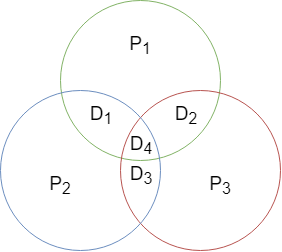
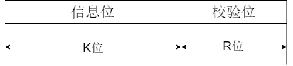

## 进位记数法

生活中常用十进制，计算机中通常使用二进制、八进制与十六进制。其中r进制数的进位表示如下：

$$
K_nr^n+K_{n-1}r^{n-1}+···+K_{-m}r^{-m} = \sum_{i=n}^{-m}{K_ir^i}
$$

式中，$r$ 是基数，$r^i$ 是第 $i$ 位的位权（整数规定 $i$ 最低为0）；$K_i$ 可以在 0 ~ $r$-1 中任意取值。

## 进制之间的转换

* 二到八与十六：打包转换
* 八与十六到二：单符转换
* 任意到十进制：各位乘以维权之和 $\sum_{i=n}^{-m}{K_ir^i}$
* 十进制到任意：
  1. 整数部份：除基取余
  2. 小数部份：乘积取整

## 数值编码

当表示数值的编码每一位有着固定的位权，这样的码叫做有权码，否则为无权码

##### BCD码

二进制编码中的十进制数（Binary Coded Decimal），通常采用4位二进制表示一位0~9。其中，10种可以表示代码，6种为冗余状态。以下是几种常见的BCD码：

* 8421码：普通的二进制码
  > | 0    | 1    | 2    | 3    | 4    | 5    | 6    | 7    | 8    | 9    |
  > | ---- | ---- | ---- | ---- | ---- | ---- | ---- | ---- | ---- | ---- |
  > | 0000 | 0001 | 0010 | 0011 | 0100 | 0101 | 0110 | 0111 | 1000 | 1001 |
  >
  > 有权码，如其名，4位的从高到低位权位 8、4、2、1。s
  >
* 余三码：8421码+3
  > | 0    | 1    | 2    | 3    | 4    | 5    | 6    | 7    | 8    | 9    |
  > | ---- | ---- | ---- | ---- | ---- | ---- | ---- | ---- | ---- | ---- |
  > | 0011 | 0100 | 0101 | 0110 | 0111 | 1000 | 1001 | 1010 | 1011 | 1100 |
  >
  > 无权码，为的是两数和大于9时，可自动进位（和+6>15）
  >
* 2421码：改变权值定义
  > | 0    | 1    | 2    | 3    | 4    | 5    | 6    | 7    | 8    | 9    |
  > | ---- | ---- | ---- | ---- | ---- | ---- | ---- | ---- | ---- | ---- |
  > | 0000 | 0001 | 0010 | 0011 | 0100 | 1011 | 1100 | 1101 | 1110 | 1111 |
  >
  > 有权码，大于等于5最高位为 1，小于5最高位为 0。为的是对9互补
  >
* 格雷码：有多种编码形式，特点相邻数字只有一个位元不同
  > 如不做特殊说明，各类么就是典型格雷码
  >
  > | 十进制数 | 4位自然二进制码 | 4位典型格雷码 | 十进制余三格雷码 | 十进制空六格雷码 | 十进制跳六格雷码 | 步进码 |
  > | -------- | --------------- | ------------- | ---------------- | ---------------- | ---------------- | ------ |
  > | 0        | 0000            | 0000          | 0010             | 0000             | 0000             | 00000  |
  > | 1        | 0001            | 0001          | 0110             | 0001             | 0001             | 00001  |
  > | 2        | 0010            | 0011          | 0111             | 0011             | 0011             | 00011  |
  > | 3        | 0011            | 0010          | 0101             | 0010             | 0010             | 00111  |
  > | 4        | 0100            | 0110          | 0100             | 0110             | 0110             | 01111  |
  > | 5        | 0101            | 0111          | 1100             | 1110             | 0111             | 11111  |
  > | 6        | 0110            | 0101          | 1101             | 1010             | 0101             | 11110  |
  > | 7        | 0111            | 0100          | 1111             | 1011             | 0100             | 11100  |
  > | 8        | 1000            | 1100          | 1110             | 1001             | 1100             | 11000  |
  > | 9        | 1001            | 1101          | 1010             | 1000             | 1000             | 10000  |
  > | 10       | 1010            | 1111          | ----             | ----             | ----             | ----   |
  > | 11       | 1011            | 1110          | ----             | ----             | ----             | ----   |
  > | 12       | 1100            | 1010          | ----             | ----             | ----             | ----   |
  > | 13       | 1101            | 1011          | ----             | ----             | ----             | ----   |
  > | 14       | 1110            | 1001          | ----             | ----             | ----             | ----   |
  > | 15       | 1111            | 1000          | ----             | ----             | ----             | ----   |
  >

## ASCII码

目前，国际上普通采用的是7位二进制编码的ASCII码。（每个字节最高位保持为 0 ，用于传输时的奇偶校验）

* 编码值 0~31 为控制字符，用于通信控制或设备的功能控制
* 编码127为DEL码，同样为控制字符，控制删除
* 编码32~126共95个字符为可印刷字符（没错空格SP 编码32也是可印刷的）

> 除了可印刷字符（编码值32\~126），其余全为控制、通信字符
>
> 1. 数字0\~9：48（0011 0000）\~   57（0011 1001）
> 2. 大写字母：65（0100 0001）~   90（0101 1010）
> 3. 小写字母：97（0110 0001）~ 122（0111 1010）
>

## 校验码

校验码是指能够发现或能够自动纠正错误的数据编码，而成检错纠错编码。本质是通过冗余码，来检验或纠错编码。

> 通常某种编码都是由许多码字构成，任意两个**合法码字**之间最少变化的二进制位数，称为数据校验码的码距。（其实就是两个合法码字之间的异或）
>
> * 对于码距不小于2的数据校验码，开始具有检错能力
> * 码距越大，检错、纠错能力就越强
> * 检错能力总是大于等于纠错能力
>

##### 1. 奇偶校验码

学习视频：

<iframe src="https://player.bilibili.com/player.html?aid=70211798&amp;bvid=BV1BE411D7ii&amp;cid=223418841&amp;page=11" data-src="//player.bilibili.com/player.html?aid=70211798&amp;bvid=BV1BE411D7ii&amp;cid=223418841&amp;page=11" scrolling="no" border="0" frameborder="no" framespacing="0" allowfullscreen="true" style="width: 532px; height: 368px;"> </iframe>

实现原理：有效信息（原编码）加装一位奇偶校验位组成校验码，是整个校验码中 "1"的个数为偶数或奇数。

编码特点：

* 码距为 2，可以检测出 1 位错误（奇数位错误，指有奇数个bit 发生翻转）；
* 不能检测出偶数位错误，同时也不能确定出错的位置；

编码分类：

* 奇校验码：整个校验码（有效信息位和校验位）中 "1" 的个数为奇数
* 偶校验码：整个校验码（有效信息位和校验位）中 "1" 的个数为偶数

> 增添的冗余位称为奇偶校验位，这种方法具有一定的局限性，他不能纠正错误，所以常用于存储器数据的检查或者传输数据的检查。
>

##### 2. 海明校验码

学习视频：

<iframe src="https://player.bilibili.com/player.html?aid=70211798&amp;bvid=BV1BE411D7ii&amp;cid=223419044&amp;page=12" data-src="//player.bilibili.com/player.html?aid=70211798&amp;bvid=BV1BE411D7ii&amp;cid=223419044&amp;page=12" scrolling="no" border="0" frameborder="no" framespacing="0" allowfullscreen="true" style="width: 520px; height: 375px;"> </iframe>

实现原理：有效信息为中加入几个校验位形成海明码，并把海明码的每个二进制位分配到几个奇偶校验组中。

根据纠错理论：

$$
L-1=D+C 且 D \geqslant C
$$

> 各个参数含义：
>
> * $L$：编码最小码距
> * $D$：检测错误的位数
> * $C$：纠正错误的位数
>
> 公式意义即：编码最小码距$L$越大，其检测错误位数$D$越大，纠正错误的位数$C$也就越大；纠错能力恒小于等于验错能力。
>

假设信息位 $n$ 个，校验位 $k$ 个。信息位+校验位共 $n+k$ 位。由于K个比特可以表示的状态数为 $2^k$个。假设出错一位的情况下，所有为可能的状态 $n+k$ 加上 1种正确的状态共 $n+k+1$种都需要表示。所以必须有

$$
2^k \geqslant n+k+1
$$

海明码的求解步骤：

1. 确定海明码的位数
   根据公式$2^k \geqslant n+k+1$，求解出所需校验位的最小位数或可以纠错的信息位的最大值；如果给定信息位和校验位位数则可以根据此不等式判断是否可以进行海明校验。
   > 例子：当 $n=4、k=3$ 时，求1010海明码。
   >
   > 可得 $2^3 \geqslant 4+3+1$，所以可以利用海明码校验，其海明码位数为 $n+k=4+3=7$，即可对应为 $H_7H_6H_5H_4H_3H_2H_1$。
   >
2. 确定校验位的分布
   设信息位为 $D_4D_3D_2D_1$，校验位为 $P_3P_2P_1$。规定校验位$P_i$再海明位号为 $2^{i-1}$的位置上。
   > 对于上面1010的例子，检验位的分布
   >
   > | H~7~ | H~6~ | H~5~ | H~4~ | H~3~ | H~2~ | H~1~ |
   > | ---- | ---- | ---- | ---- | ---- | ---- | ---- |
   > | D~4~ | D~3~ | D~2~ | P~3~ | D~1~ | P~2~ | P~1~ |
   > | 1    | 0    | 1    | ---  | 0    | ---  | ---  |
   >
3. 分组形成校验关系
   由于要定位错误的所在，所以每个数据位用多个校验位进行校验，但要满足条件：被校验数据位的海明位号等于校验该数据为的各校验位海明位号之和。
   > 校验位不需要再被校验，所以分组形成的校验关系如下：
   >
   > * D1=>H3 => 3=011，被P2、P1校验
   > * D2=>H5 => 5=101，被P3、P1校验
   > * D3=>H6 => 6=110，被P3、P2校验
   > * D4=>H7 => 7=111，被P3、P2、P1校验
   >
   > 也可以根据这种对应整理：
   >
   > |           | P3（H4） | P2（H2） | P1（H1） | 海明位号关系 |
   > | -------- | -------- | -------- | -------- | ------------ |
   > | D1（H3） | 0        | 1        | 1        | 3=2+1        |
   > | D2（H5） | 1        | 0        | 1        | 5=4+1        |
   > | D3（H6） | 1        | 1        | 0        | 6=4+2        |
   > | D4（H7） | 1        | 1        | 1        | 7=4+2+1      |
   >
4. 校验位取值：
   校验位$P_i$的取值为第 $i$ 组（所有受该校验位校验的数据位）的所有位异或。
   > 所以由校验关系：
   >
   > $$
   > P_1 = D_1  \oplus D_2 \oplus D_4 =  0 \oplus 1 \oplus 1 = 0\\
   > P_2 = D_1  \oplus D_3 \oplus D_4 =  0 \oplus 0 \oplus 1 = 1\\
   > P_3 = D_2  \oplus D_3 \oplus D_4 =  1 \oplus 0 \oplus 1 = 0\\
   > $$
   >
   > 所以该海明校验码为：
   >
   > | H~7~ | H~6~ | H~5~ | H~4~ | H~3~ | H~2~ | H~1~ |
   > | ---- | ---- | ---- | ---- | ---- | ---- | ---- |
   > | D~4~ | D~3~ | D~2~ | P~3~ | D~1~ | P~2~ | P~1~ |
   > | 1    | 0    | 1    | 0    | 0    | 1    | 0    |
   >
5. 海明码校验原理
   每个校验组，分别利用校验位和参与形成该校验位的信息位，进行奇偶校验检查。
   $$
   S_1 = P_1 \oplus D_1  \oplus D_2 \oplus D_4 \\
   S_2 = P_2 \oplus D_1  \oplus D_3 \oplus D_4\\
   S_3 = P_3 \oplus D_2  \oplus D_3 \oplus D_4\\
   $$

若 $S_3S_2S_1$ 的值为 000， 则说明无措；否则说明出错，且这个数就是错误为的位号。如 $S_3S_2S_1$ 的值为 110 则说明第6位，即 $H_6$ 出错。

> 我们可以看出，海明码具有一个比特位的纠错能力和两个比特位的检错能力。
>
> * 纠错能力（1位）：$S_3S_2S_1$ 表示位置。
> * 检错能力（2位）：如果两个同时发生错误，可以通过 $S_3S_2S_1$不等于零判断得出。
>
> 全校验位：在整体前面加上一位作为海明码的偶校验位，对海明码整体进行偶校验。
>
> * $S_3S_2S_1 = 000 \\$ ，且全体偶校验成功，无错误
> * $S_3S_2S_1 \neq 000$ ，且全体偶校验失败，则是奇数个位错误，可靠传输下大概率是1个位错误，所以位置即 $S_3S_2S_1$，改正即可。
> * $S_3S_2S_1 \neq 000$ ，且全体偶校验成功，偶数个位错误，没有办法，重传（retransmission）吧😄。
>

##### 3. 循环冗余校验（CRC）码

学习视频：

<iframe src="https://player.bilibili.com/player.html?aid=70211798&amp;bvid=BV1BE411D7ii&amp;cid=223419370&amp;page=13" data-src="//player.bilibili.com/player.html?aid=70211798&amp;bvid=BV1BE411D7ii&amp;cid=223419370&amp;page=13" scrolling="no" border="0" frameborder="no" framespacing="0" allowfullscreen="true" style="width: 538px; height: 367px;"> </iframe>

$CRC$的基本思想是：在K位信息码后再拼接$R$位的校验码，整个编码的长度为N位，这种编码又称为$（N，K）$码。

**$CRC$编码基于线性编码理论**：

* 发送端：将要发送的$K$位二进制代码左移$R$位，将它与生成多项式 $G(x)$做模2除法，生成一个$R$位的校验码，并附在信息码后，构成一个新的二进制码（CRC码），共$K+R$位。
* 信息端：利用生成多项式对接收到的编码做模2除法，以检测和确定出错的位置，如果无错则整除。

**$CRC$编码生成步骤**：

* 确定 K、R以及生成多项式对应的二进制码
* 左移R位，低位补0
* 模2除法（异或运算）
* $R$位余数添加到左移后$R$位零的位置

**$CRC$编码检错和纠错**：

* 检错：若接收到的$CRC$码用生成多项式$G(x)$做模2除法，若余数为0，则码字无错；不为0，则说明出现错误。
* 纠错：当模2除法获得余数为 $L_R···L_1$，其十进制的值就是$CRC$码的索引。
  > 例如得到余数为 010 时，则是$CRC$码 $C_9C_8C_7C_6C_5C_4C_3C_2C_1$中的$C_2$出错。
  >