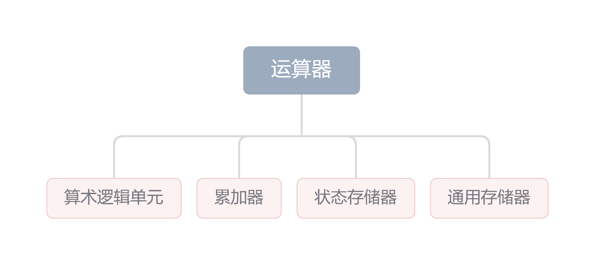
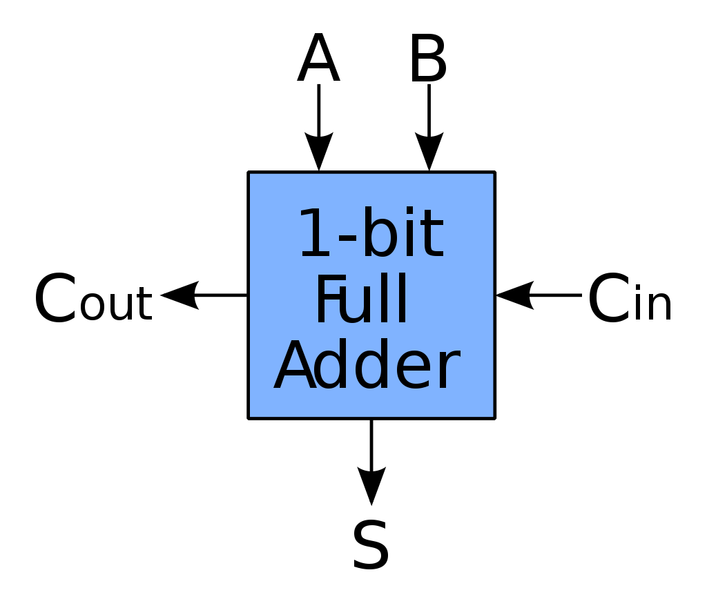
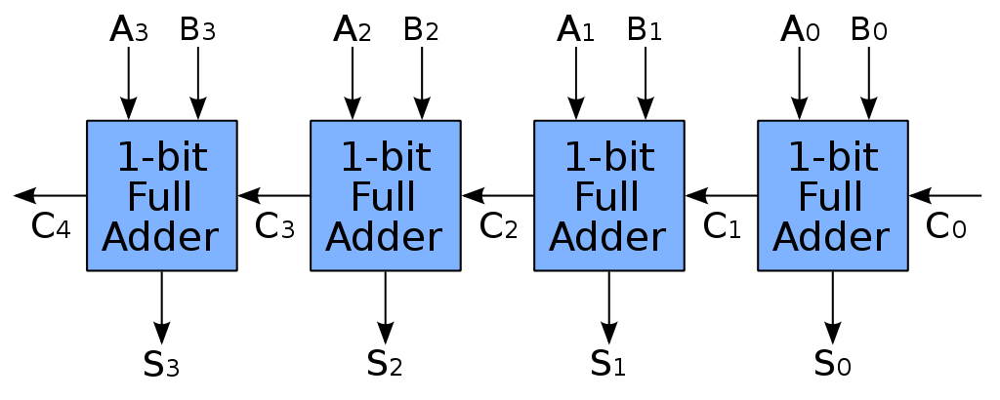
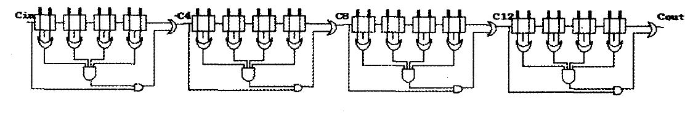
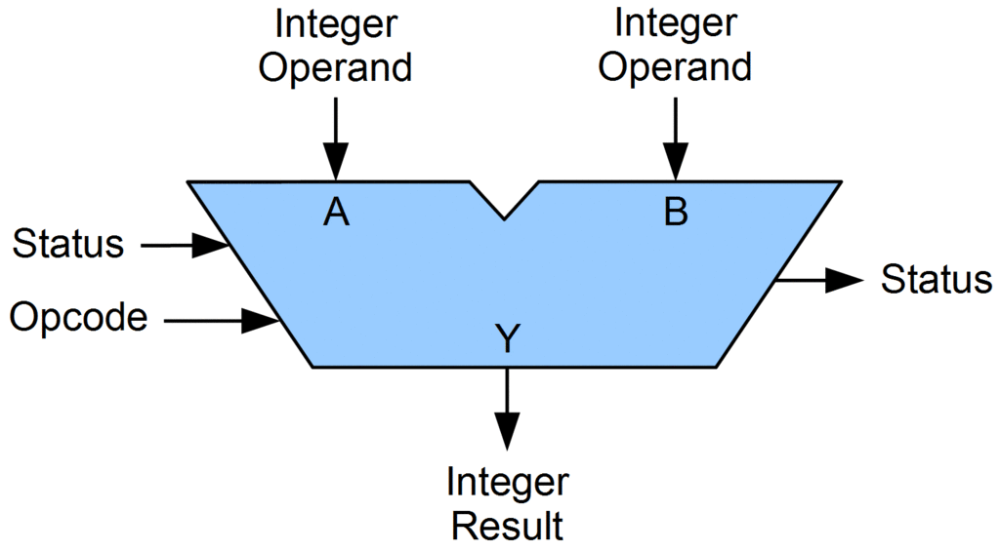

## 运算器基本组成

在计算机中，运算器承担了执行各种算术和逻辑运算的工作。运算器由算术逻辑单元、累加器、状态存储器和通用存储器组成：

* [算术逻辑单元](https://zh.wikipedia.org/zh-hans/%E7%AE%97%E8%A1%93%E9%82%8F%E8%BC%AF%E5%96%AE%E5%85%83)（[ALU](https://simple.wikipedia.org/wiki/Arithmetic_logic_unit)）：基本功能包括四则运算与逻辑运算与移位求补等
* [累加器](https://zh.wikipedia.org/wiki/%E7%B4%AF%E5%8A%A0%E5%99%A8)（[Accumulator](https://en.wikipedia.org/wiki/Accumulator_(computing))）：一种寄存器，存储计算过程产生的中间结果
* 状态存储器（[Status Register](https://en.wikipedia.org/wiki/Status_register)）：处理器状态标志位的集合
* 通用存储器（General Register）：存储计算中需要的一下数值



ALU的基本功能包括加减乘除四则运算、与或非异或等逻辑运算，以及移位、求补等操作。具体功能与结构在下面展开。

## 加法器组成逻辑

ALU的核心部件是[加法器](https://zh.wikipedia.org/wiki/%E5%8A%A0%E6%B3%95%E5%99%A8)（Adder），加法器是由全加器再配以其他必要的逻辑电路组成的，根据组成全加器的个数是单个还是多个，加法器有串行并行之分

### 一位全加器

[全加器](https://zh.wikipedia.org/wiki/%E5%8A%A0%E6%B3%95%E5%99%A8#%E5%85%A8%E5%8A%A0%E5%99%A8)（Full Adder，FA）是最基本的加法单元，将两个一位二进制$A$与$B$相加后再根据低位进位信号$C_{in}$，输出和$S$、进位输出$C_{out}$。



全加器的逻辑表达式如下：

* 和表达式   ：$S_i=A \oplus B \oplus C_{in}$
* 进位表达式：$C_{out}=AB+(A\oplus B )C_{in}$

一位全加器的逻辑结构如上右图所示。

### 串行加法器

[串行加法器](https://en.wikipedia.org/wiki/Serial_binary_adder)中，只有一个全加器，数据逐位送入全加器中进行计算。

> 同时有一个进位寄存器（carrier），存储每步的进位
>

### 并行加法器

[并行加法器](https://baike.baidu.com/item/%E5%B9%B6%E8%A1%8C%E5%8A%A0%E6%B3%95%E5%99%A8/10907002)由多个全加器组成，全加器位数与机器字长相同，一次输入数据。实现上可以分为**串行进位**与**并行进位**

#### 串行进位

把 $n$ 个全加器串联起来，进行两个 $n$ 位数的相加 。串行进位又称波纹或行波进位，每级进位直接依赖于前一级的进位，即进位信号是逐级形成的。



其中，每位的进位与和的逻辑表达式有：

$$
\begin{array}{ll}
&C_i=A_iB_i+(A_i\oplus B_i)C_{i-1}\\
&S_i=A_i\oplus B_i \oplus C_{i-1}\\
\end{array}
$$

> 可见，由于高位对低位的数据依赖，串行进位的并行加法器的最长运算时间主要是由进位信号的传递时间决定的。
>

#### 并行进位

并行进位又称先行进位、同时进位，其特点是各级进位信号几乎同时形成。实现方法如下——我们首先令 $G_i=A_iB_i$，$P_i=(A_i\oplus B_i)$，则有：

$$
\begin{aligned}
&C_1=G_1+P_1C_0\\
&C_2=G_2+P_2C_1=G_2+P_2G_1+P_2P_1C_0\\
&···\\
& C_n=G_n+P_nC_{n-1}+···+P_nP_{n-1}···P_2G_1+P_nP_{n-1}···P_2P_1C_0 \\
\end{aligned}
$$

上式各式中所有进位仅由 $G_i$、$P_i$ 以及最低进位输入$C_0$决定，而不依赖于其地位的进位输入 $C_{i-1}$，因此各级输出可以同时产生（不考虑电路时延）。

> 直接实现上述逻辑的加法器称为**先行进位加法器**（[CLA](https://en.wikipedia.org/wiki/Carry-lookahead_adder)），但是由于随着先行进位加法器的位数增加，$C_i$的逻辑表达式会变得会越来越长，所以完全采用并行进位是不现实的，所以会对并行进位有着如下优化。
>

##### 分组并行进位

实际上通常采用分组并行进位方式。这样把 $n$ 位全加器分为若干个小组，各小组内的各位之间实行并行快速进位；小组与小组之间采用串行进位方式，也可采用并行快速进位方式。

###### 单级先行进位方式

单级先行进位方式，又称为**组内并行**、**组间串行**进位方式。



> 除了上述的进位跳跃加法器实现，每一个分组同样可以使用$\text{CLA}$来实现，也可以构成单级先行进位加法器
>

###### 多级先行进位方式

多级先行进位方式，又称为**组内并行**、**组间并行**进位方式。以16位字长加法器为例

$$
\begin{aligned}
C_4\   &=G_1^*+P_1^*C_0\\
C_8\   &=G_2^*+P_2^*C_4\\
C_{12}&=G_3^*+P_3^*C_8\\
C_{16}&=G_4^*+P_4^*C_{12}\\
\end{aligned}
$$

其中，$P_i^*$称为组进位传递函数，$G_i^*$称为组进位产生函数。以第一组示例：

$$
\begin{aligned}
& G_1^*= G_4+P_4G_3+P_4P_3G_2+P_4P_3P_2G_1\\
&  P_1^*=P_4P_3P_2P_1\\
\end{aligned}
$$

其他组可以类比第一组得出，发现新得到的分组在形式上等同于4位串行进位，所以可以再次使用并行进位方式进行优化。从而形成多级的先行进位加法器。

## ALU结构和功能

在[计算](https://en.wikipedia.org/wiki/Computing "Computing")中， **算术逻辑单元** （ALU） 是一个[组合](https://en.wikipedia.org/wiki/Combinational_logic "Combinational logic")[数字电路](https://en.wikipedia.org/wiki/Digital_circuit "Digital circuit")，对[整数](https://en.wikipedia.org/wiki/Integer "Integer")[二进制数字](https://en.wikipedia.org/wiki/Binary_number "Binary number")执行[算术](https://en.wikipedia.org/wiki/Arithmetic "Arithmetic")和[位向操作](https://en.wikipedia.org/wiki/Bitwise_operation "Bitwise operation")（这与[浮点运算单元](https://en.wikipedia.org/wiki/Floating-point_unit "Floating-point unit")（FPU） 形成鲜明对比，后者作用于浮点数）。ALU常见逻辑结构如下：



ALU输入的是操作数（[operands](https://en.wikipedia.org/wiki/Operand)）、操作码（[opcode](https://en.wikipedia.org/wiki/Arithmetic_logic_unit#Opcode)）；输出的是操作后的结果。往往在输入输出的时候还会伴随着状态，以便在从之前操作向当前操作传递信息（依靠 状态寄存器 [Status Register](https://en.wikipedia.org/wiki/Status_register)）。

描述简单 8-bit ALU 功能的 Verilog代码如下：

```verilog
module alu(
           input [7:0] A,B,  // ALU 8-bit Inputs               
           input [3:0] ALU_Sel,// ALU Selection
           output [7:0] ALU_Out, // ALU 8-bit Output
           output CarryOut // Carry Out Flag
    );
    reg [7:0] ALU_Result;
    wire [8:0] tmp;
    assign ALU_Out = ALU_Result; // ALU out
    assign tmp = {1'b0,A} + {1'b0,B};
    assign CarryOut = tmp[8]; // Carryout flag
    always @(*)
    begin
        case(ALU_Sel)
          4'b0000: ALU_Result = A + B ; // Addition
          4'b0001: ALU_Result = A - B ; // Subtraction
          4'b0010: ALU_Result = A * B ; // Multiplication
          4'b0011: ALU_Result = A / B ; // Division

          4'b0100: ALU_Result = A <<1 ; // Logical shift left
          4'b0101: ALU_Result = A >>1; // Logical shift right
s
          4'b0110: ALU_Result = {A[6:0],A[7]}; // Rotate left
          4'b0111: ALU_Result = {A[0],A[7:1]}; // Rotate right
  
          4'b1000: ALU_Result = A & B ; //  Logical and 
          4'b1001: ALU_Result = A | B ; //  Logical or
          4'b1010: ALU_Result = A ^ B ; //  Logical xor 

          4'b1011: ALU_Result = ~(A | B); //  Logical nor
          4'b1100: ALU_Result = ~(A & B); // Logical nand 
          4'b1101: ALU_Result = ~(A ^ B); // Logical nxor

          4'b1110: ALU_Result = (A > B)?  8'd1:8'd0 ; // Greater comparison
          4'b1111: ALU_Result = (A == B)? 8'd1:8'd0 ; // Equal comparison   
  
	  default: ALU_Result = A + B ; 
        endcase
    end

endmodule
```