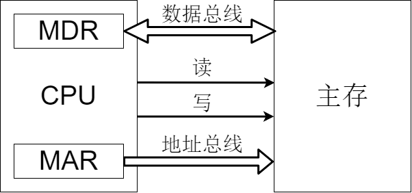
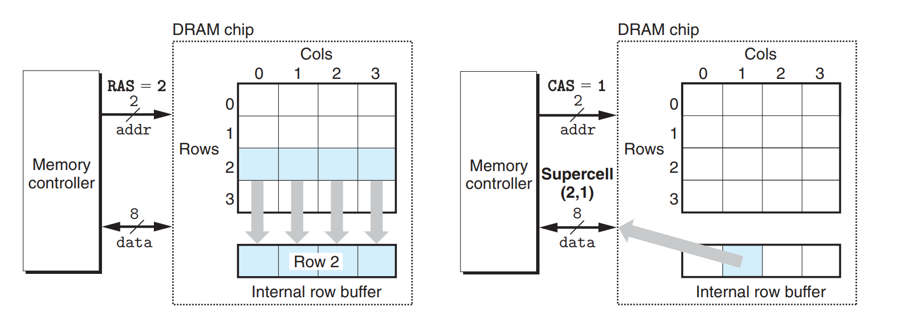
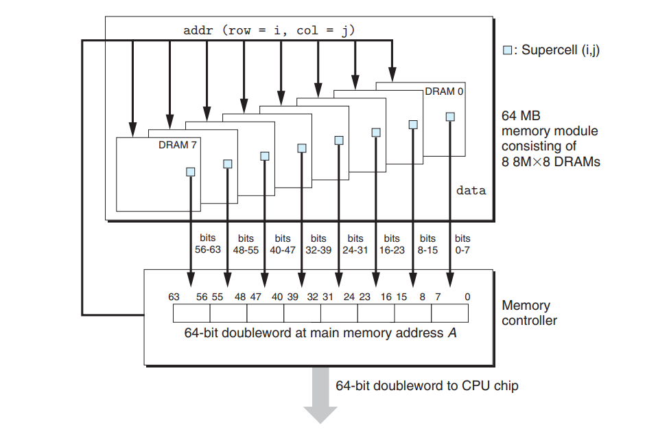
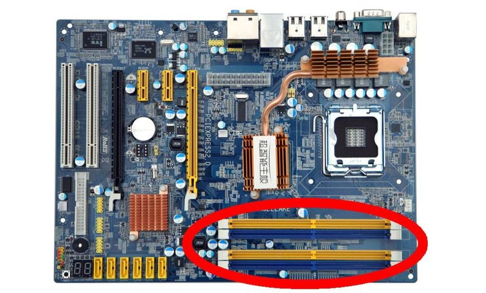

## 主存CPUの连接

* 主存储器通过数据总线、地址总线和控制总线与CPU联系。
* 数据总线的位数和工作频率的乘积正比于数据的传输率
* 地址总线的位数决定了可寻址最大内存空间
* 控制总线（读/写）指出总线周期类型和本次输入输出操作完成的时刻

## 主存容量的扩展

由于单个存储芯片容量是有限的，他在字数或者字长方面与实际存储器都有差距，因此需要在字和位两方面进行扩充才能满足实际存储器的容量要求。通常采用**位扩展法**、**字扩展法**和**字位同时扩展法**。

### 位扩展法

CPU的数据线数与存储芯片的数据位数不一定相等，此时必须对存储芯片扩位，即用多个存储期间对字长进行扩充，增加存储字长，使其数据位数与CPU的数据线数相等。

> 举例说明对于 8K×1位的存储芯片，通过13bit（$8$K=$2^{13}$）地址可以访问到1bit的数据，如果想通过地址获得8bit的数据，只需要数据总线长度个数的存储芯片，可以充分利用数据总线。
>

### 字扩展法

字扩展是指增加存储器中字的数量（实际上就是地址范围的扩大），而位数（存储字长）不变。字扩展将芯片的地址线、数据线、读写控制线相应并联，而由片选信号来区分各芯片的地址范围。

> 举例说明对于 8K×8位的存储芯片，如果数据总线8bit占满而地址总线16bit的高位没有占满（13/16），那么剩下3bit可以使用3-8译码器（$n-2^n$[译码器](https://zh.wikipedia.org/zh-hans/%E8%AF%91%E7%A0%81%E5%99%A8)）来选择工作的存储芯片，从而扩展地址范围。
>

例如，双通道内存就是使用字扩展法通过片选法来扩展内存的容量，所以对两片芯片的要求是比较严格的。

### 字位扩展法

字位同时扩展法顾名思义，就是既增加存储字的数量，又增加存储字长。

## 存储器与CPU的链接

1. 合理选择存储芯片
2. 地址线的连接
3. 数据线的连接
4. 读/写命令线的连接
5. 片选线的连接

## 学习视频

<iframe width="560" height="315" src="https://www.youtube.com/embed/K0yXPMlBsSs" data-src="https://www.youtube.com/embed/K0yXPMlBsSs" title="YouTube video player" frameborder="0" allow="accelerometer; autoplay; clipboard-write; encrypted-media; gyroscope; picture-in-picture" allowfullscreen=""></iframe>