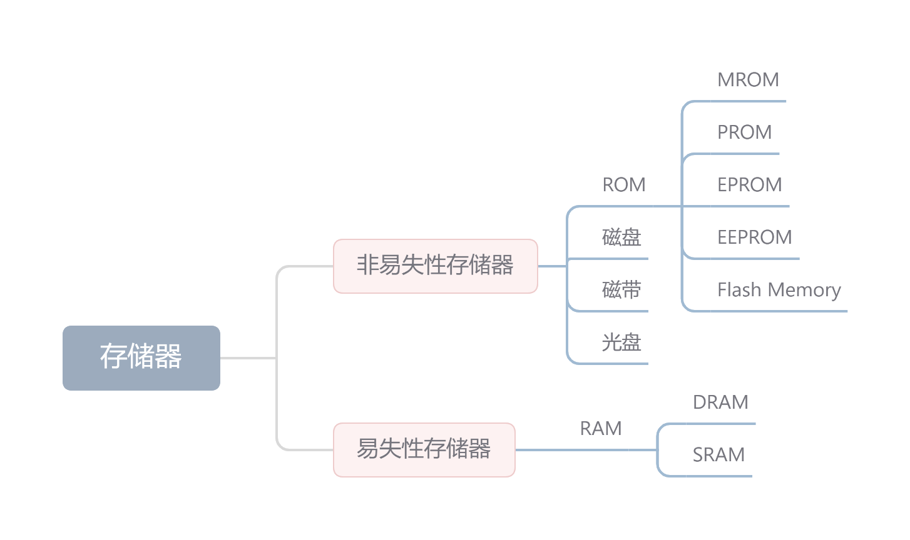

## 存储器的分类

> 其中，现代内存主要是由DRAM组成；而现在辅存主要是由硬盘和闪存固态盘组成。
>

## 存储器层次化结构

为了解决存储系统大容量、高速度和低成本之间的相互制约的矛盾，在计算机系统中通常采用多级存储器的结构。

存储系统层级结构的主要思想是**上一层的存储器作为低一层存储器的高速缓存**。主要体现在"Cache-主存"层次和"主存-辅存"层次，其中：

* "Cache-主存"层次：解决CPU和主存速度不匹配的问题
* "主存-辅存"层次：解决存储系统的容量问题

在存储体系中，Cache、主存能够与CPU直接交换信息，辅存则主要通过主存与CPU交换信息。

现代计算机系统几乎都采用这三级存储系统，需要注意的是：

* 主存和Cache之间的调动由硬件自动完成，对所有程序员透明
* 主存和辅存之间的数据调动则是由硬件和操作系统共同完成的，对应用程序员是透明的

> 主存和辅存这层次在不断发展中，逐渐形成了虚拟存储系统，这个系统中程序员编程的地址范围与虚拟存储器的地址空间相对应。对于具有虚拟存储器的计算机系统而言，编程可用的地址空间远大于主存空间。
>