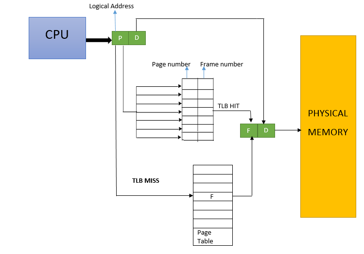

## 虚拟存储器概念

**主存**和**联机工作的辅存**共同构成了虚拟存储器，二者在硬件和软件的共同管理下工作。对于应用程序员来说，虚拟存储器是透明的。

> 虚拟存储器将主存或辅存的地址空间统一编址，形成一个庞大的地址空间；在这个空间内，用户可以自由编程，而不必在乎实际的存储容量和程序在储存中实际存放的位置。
>


其中，用户编程允许涉及的地址称为 **虚地址** （或 **逻辑地址**），虚地址对应的空间为虚拟空间或程序空间；实际的存储单元地址称为 **实地址**（或 **物理地址**），实地址对应的是主存地址空间，也称实地址空间。

$$
\begin{array}{llll}
&虚地址&=  &虚存页号+页内字地址\\·
&实地址&= &主存页号+页内字地址\\
&辅存地址&=&磁盘号+盘面号+磁道号+扇区号\\


\end{array}
$$

CPU在使用虚地址时要找出虚地址与实地址的对应关系，并且判断改虚地址对应的存储单元是否已经装入主存。

* 若在主存中，则通过地址变换，CPU可以直接访问主存指示的实际单元
* 若不在主存中，则先从辅存中查找地址对应的页或段，再将其调入主存
  * 如果主存未满，则调入主存后调整页表内容，并由CPU进行访问
  * 如果主存已满，则先使用替换算法置换主存中的段或页后再访问

> 在实际的物理存储层级上，所编程序和数据在操作系统管理下，先送入磁盘，然后操作系统将当前运行所需要的部分调入主存，供CPU使用，其余暂不运行的部分则留在磁盘中。
>

## 页式虚拟存储器

以页为单位的虚拟存储器称为页式虚拟存储器。特征是整个虚拟空间与主存空间都被划分为同样大小的页。其中，主存中的页称为实页；虚存中的页称为虚页。


类比缓存中对于块的处理，可以把地址分为两个字段：页号+页内地址。其中，虚拟地址的页号称为虚页号，物理地址的页号称为实页号。

### 页表

页表是存放在主存中的虚页号到实页号映射关系表。它记录着程序虚页调入主存时被安排在主存中的位置，所以页表需要常驻于主存中。


上图即为主存中的页表示例图，其中每行所需要的信息如下：

* 有效位：页面是否已经调入主存
* 脏位：页面是否被修改
* 引用位：页面置换算法（比如：可以统计页面访问次数）
* 物理页：有效位为1，存储主存块号
* 磁盘地址：有效位为0，存储页面在磁盘中的位置

下图是从虚拟地址到物理地址的实际转化过程。


### 快表

CPU将虚拟地址转化为物理地址过程中，都要访问主存来实现，然后再获取数据。根据程序执行的局部性原理，在一段时间内总是经常访问某些页时，把这些页的对应的页表项放到高速缓冲存储器组成的**快表**（[Translation lookaside buffer](https://en.wikipedia.org/wiki/Translation_lookaside_buffer)，TLB）中，从而实现虚拟地址到物理地址更快的转换。



快表也是一种[相联存储器](https://baike.baidu.com/item/%E7%9B%B8%E8%81%94%E5%AD%98%E5%82%A8%E5%99%A8/7673751)，同样是通过标记位来获取到物理页号。若命中，则直接输出物理页号与页内地址组成的物理地址；若没有命中，则通过访存操作从慢表（对应内存中的页表）获取，然后根据适当算法更新快表。


## 段式虚拟存储器

段式虚拟存储器中的段（Segment）是按照程序的逻辑结构来划分的，各个段的长度因程序而异。分段（[Memory Segmentation](https://en.wikipedia.org/wiki/Memory_segmentation)）把虚拟地址分为：**段号** 与 **段内地址**。虚拟地址到实地址的变换是通过 段表 来实现的。

```plaintext
assume cs:code, ds:data, ss:stack
data segment
    ···
data ends
stack segment
    ···
stack ends
code segment
    ···
code ends
```

从高级语言程序中很难看出段结构，不过从汇编程序中可以明显看出段结构。可以看出，段表中的信息需要有每个段对应的短号、装入位、段起点与段长信息（由于段的长度可变）。


## 段页式虚拟存储器

把程序按照逻辑结构分段，每段在划分为固定大小的页，主存空间也划分成大小相等的页。程序对主存的调入调出仍以页为基本传送单位，这样的存储器称为段页式虚拟存储器。

> 段页式虚拟存储器中，每个程序对应一个段表，每段对应一个页表，段的长度必须是页的长度的整数倍，段的起点必须是某一页的起点。
>

虚地址分为：**段号**、**段内页号** 和 **页内地址** 三个部分。CPU根据虚地址访存时，首先根据段号得到段表地址，然后从段表中取出该段页表起始地址，与虚地址段内页号合成得到页表地址；最后从页表中取出实页号，与页内地址拼接而成形成主存实地址。