## Cacheの出现

由于程序的转移概率不会很低，数据分布的离散性较大，所以单纯依靠并行主存系统提高主存系统的频宽是有限的。这就必须从系统结构上进行改进，级采用存储体系。通常将存储系统分为"Cache-主存"和"主存-辅存"层次。

> 同时归功于计算机领域专家预见存储对计算机性能的限制
>

## 程序访问的局部性原理

程序访问的局部性原理包括**时间局部性**和**空间的局部性**。

* **时间局部性**：在未来将要用到的信息，很可能是现在正在使用到的信息
* **空间局部性**：在最近的未来要用到的信息，很可能与现在正使用的信息在存储空间上是邻近的

> 时间局部性主要是因为程序中可能存在的大量的 *循环结构* ；空间局部性是因为指令通常是 *顺序存放*、*顺序执行* 的，数据也是以向量数组等形式 *簇聚* 地存储在一起的。
>

下面看两组代码，假定数组元素按照行优先存储，对于下面两个函数：

1. 对于数组$a$的访问，哪个空间局部性更好，哪个时间局部性更好？
2. 对于指令访问来说，$\text{for}$ 循环的空间局部性和时间局部性怎么样？

```cpp
// program A
int sumarrayrows(int a[M][N])
{
    int i, j, sum = 0;
    for(i = 0; i < M; i++)
        for(j=0; j < N; j++)
            sum += a[i][j];
    return sum;
}
```

```cpp
// program B
int sumarrayrows(int a[M][N])
{
    int i, j, sum = 0;
    for(i = 0; i < M; i++)
        for(j=0; j < N; j++)
            sum += a[i][j];
    return sum;
}
```

## Cache的基本工作原理

[Cache](https://simple.wikipedia.org/wiki/Cache_(computing))位于存储器层次结构的顶层，通常由$\text{SRAM}$构成。本节讨论的是[CPU Cache](https://zh.wikipedia.org/zh-hans/CPU%E7%BC%93%E5%AD%98)，其基本原理如图：

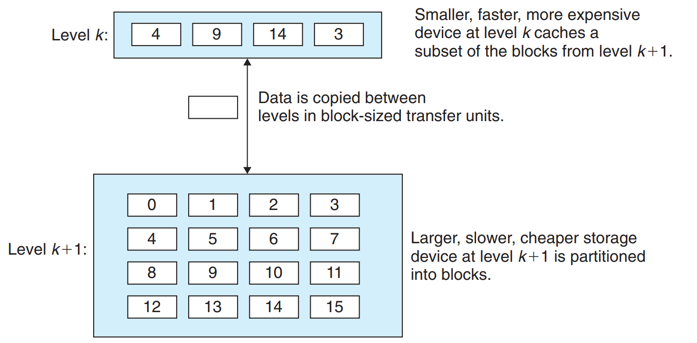

由图可知，$k$层可以作为$k+1$层的缓存。对于CPU Cache，由于缓存中的块数少于主存中的块数，所以需要根据某种策略，通过算法预测装入未来CPU最可能访问的数据。

但是由于不可能完美预测出CPU可能执行的程序和装入的数据，所以在访问缓存的时候会有着不同的状况：

### 缓存命中与不命中

如果缓存中存储并提供程序所需的数据对象，则称缓存命中（Cache Hits）；如果没有这个数据对象，则称为缓存不命中（Cache Misses）。

### 缓存未命中的种类

通过缓存架构实现的处理器性能提升很大程度长取决于对于数据请求缓存能否命中。不成功的缓存读写策略反而会造成主存访问延时。这里主要介绍三种基本的缓存未命中（[3Cs](https://en.wikipedia.org/wiki/Cache_performance_measurement_and_metric#Introduction_to_types_of_cache_misses)）。

#### Compulsory misses

首取未命中，每当内存块首次被调用时就会引发，可能的此类未命中的数目为其他未引用内存块的数量。这类缓存未命中也被称为冷未命中（**code misses**）。只要块没被预取，**code misses**就不可能被避免。

> 充分利用程序与数据的空间局部性可以减少冷未命中的发生
>

#### Conflict misses

冲突未命中（conflict misses）发生在缓存中之前获取的数据被覆盖去除。这种覆盖发生因为其他内存块访问映射了与所需数据映射后的同一缓存行。

> 通过良好的Cache和主存映射函数，可以减少冲突未命中的可能
>

#### Capacity misses

容量未命中（Capacity misses）发生因为缓存有限的大小而不是缓存的映射函数。当程序所需的重要数据字节数显著大于缓存容量。

> 单处理器下基本上出去冷未命中与冲突未命中就是容量未命中
>

## Cache和主存之间的映射关系

Cache行中的信息是主存中某个块的副本，**地址映射**即把主存地址空间映射到Cache地址空间。地址映射的方法有：直接映射、全相联映射、组相联映射。

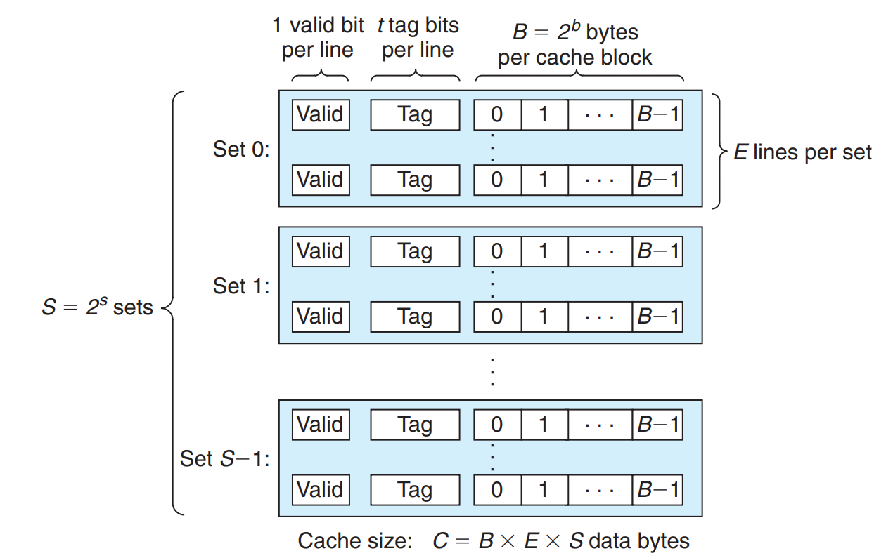

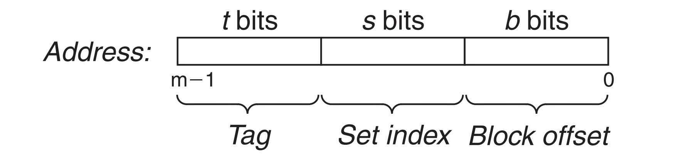

> Aside：Cache lines, sets, and blocks: What’s the difference?
>
> It is easy to confuse the distinction between cache lines, sets, and blocks. Let’s review these ideas and make sure they are clear:
>
> * A block is a fixed-sized packet of information that moves back and forth between a cache and main memory (or a lower-level cache).
> * A line is a container in a cache that stores a block, as well as other information such as the valid bit and the tag bits.
> * A set is a collection of one or more lines. Sets in direct-mapped caches consist of a single line. Sets in set associative and fully associative caches consist of multiple lines.
>
> In direct-mapped caches, sets and lines are indeed equivalent. However, in associative caches, sets and lines are very different things and the terms cannot be used interchangeably.
>
> Since a line always stores a single block, the terms “line” and “block” are often used interchangeably. For example, systems professionals usually refer to the “line size” of a cache, when what they really mean is the block size. This usage is very common, and shouldn’t cause any confusion, so long as you understand the distinction between blocks and lines.
>

### 直接映射

主存中的每一块只能装入Cache中的唯一位置。若这个位置已有内容，则产生块冲突 。

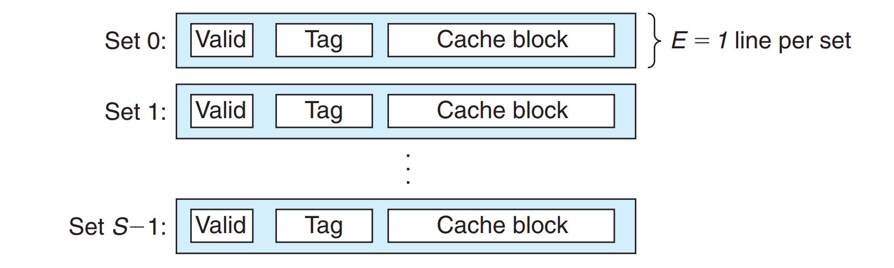

直接映射的关系可定义为：$j=i \mod{ 2^c}$

> 式子中，$j$是Cache的块号（行号），$i$是主存的块号，$2^c$是Cache总块数
>

直接映射的地址结构：$标记:Cache行号:块地址$

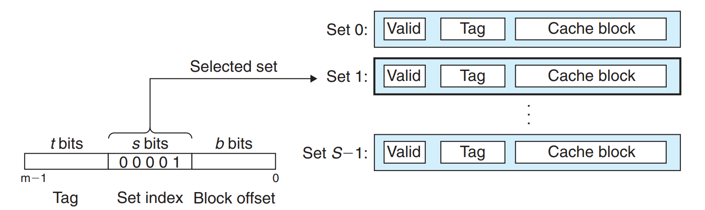

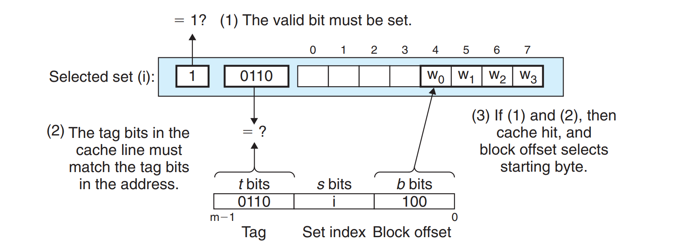

> 优点：对于任何一个地址，只需对比一个标记，速度最快；缺点：Cache存储空间利用不充分。
>

### 全相联映射

主存中的每一块可以存储到Cache中的任意位置。每行的标记用于指出该行取自主存的哪一块，所以CPU访存时候需要同所有Cache行标记进行比较。

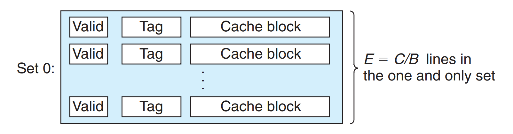

全相联映射的地址结构如下：$标记:块内地址$


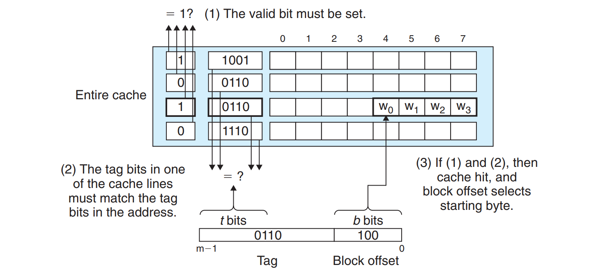

> 优点：CPU存储空间利用充分，命中率高；缺点：查找标记慢，可能要对比所有行的标记。
>

### 组相联映射

将Cache空间分成大小相等的组，主存的主存快可以装入一组内的任何一个位置，即组件采用直接映射，组内采用全相联映射。

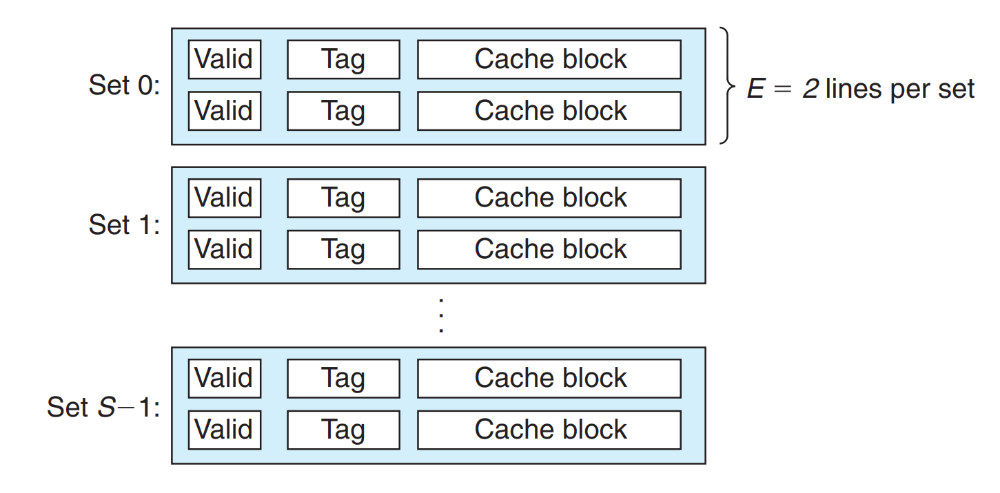

组相联映射的关系可定义为：$j=i\mod{Q}$

> 其中，$j$是Cache的组号，$i$是主存的块号，$Q$是Cache的组数
>

它是直接映射和全相联映射的一种折中：如果$Q=1$则变为全相联映射，当$Q=Cache块数$的时候则变为直接映射。假设每组有$r$个Cache行，则称为$r$路组相联。

组相联映射的地址结构：$标记:组号:块内地址$

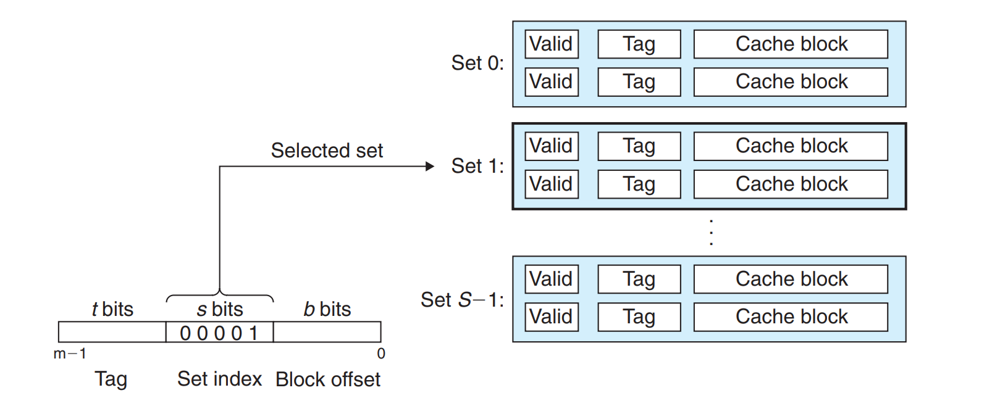

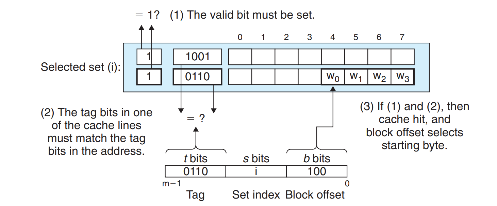

> 直接映射方法与组相连映射的折中
>

## Cache主存块替换算法

采用全相联和组相联映射方式时，从主存向Cache传送一个新块，当Cache或Cache组中的空间全被占满时，就要使用替换算法置换。常见的

### 随机算法（RAND）

随机算法（RAND，Random）随机地确定替换的Cache块，它的实现比较简单，但未依据程序访问的局部性原理，所以命中率较低。

### 先入先出算法（FIFO）

先入先出算法（FIFO，First In First Out）选择最早调入的行进行替换，较容易实现，但是同样未依据程序访问的局部性原理，因为最早进入主存的内存块可能也是目前经常要使用的。

### 最近最少使用算法（LRU）

最近最少使用算法（LRU，Least Recently Used）根据程序访问的局部性原理，选择近期内长久为访问过的Cache行作为替换的行，平均命中率比FIFO要高，是堆栈类算法。

> * 初始化计数器为0；命中时计数器清零，否则加1；替换最大记数行
> * 尽管符合局部性原理，命中率比较优秀，但是缺陷在于当经常使用的内存块数超过缓存所能存储的块数，则会发生抖动。
>

### 最不经常使用算法（LFU）

最不经常使用算法（LFU，Least Frequently Used）将一段时间内被访问次数最少的存储行换出。

> * 同样的计数器初始化为0；命中后加1；替换计算器最小。
> * 曾经被访问次数最多不能代表之后更大的访问可能性
>

## Cache写策略

因为Cache中的内容时内存块副本，它对于CPU访存应当时透明的。因此，当Cache中的内容更新时，内存中的对应内容也应在适当的时机更新，即要保持Cache与主存的数据一致性。

### Cache写命中处理方法

写命中的时候可以改变Cache中的数据，处理方法区别在于何时将更新的数据写到内存。

#### 全写法

全写法（wirte-through）CPU写命中时，将数据同时写入Cache和内存

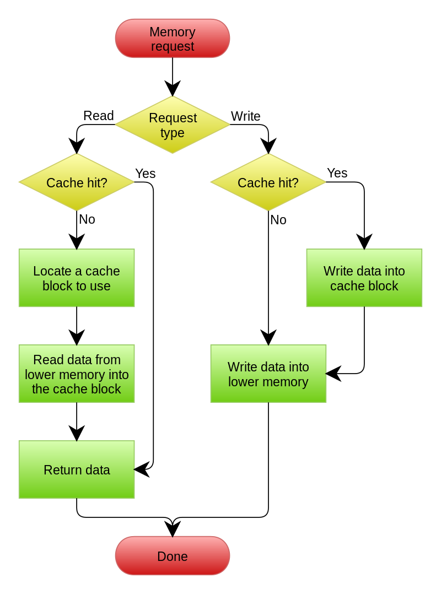

#### 写回法

写回法（write-back）CPU写命中时，只修改Cache的内容，而不立即写入主存，直到被修改的块被换出缓存时才写回内存。

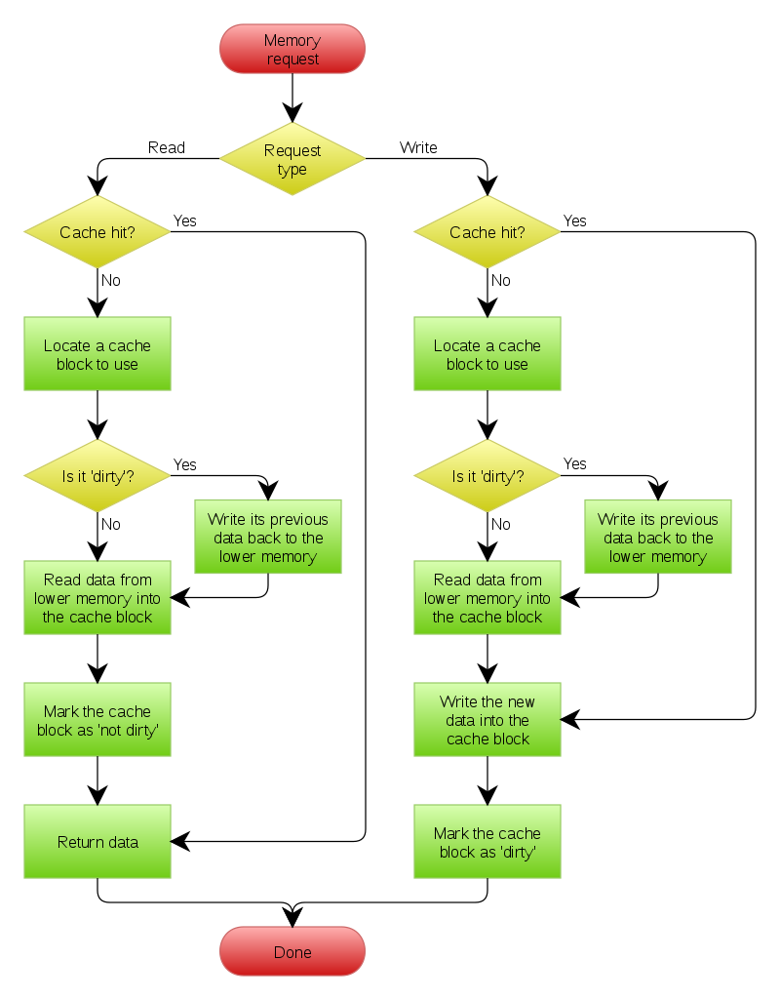

> 采用这个方法，每行Cache必须设置一个标志位（脏位），以反映此块是否被CPU修改过
>

### Cache写不命中处理方法

写不命中的时候直接访问内存，处理方法区别是是否将访存获得的块添到缓存中去。

#### 写分配法

写分配法（write-allocate）加载主存中的块到Cache中，然后更新这个Cache块。

#### 非写分配法

非写分配法（not-write-allocate）只写入主存，不进行调换。

## 多层次Cache性能计算

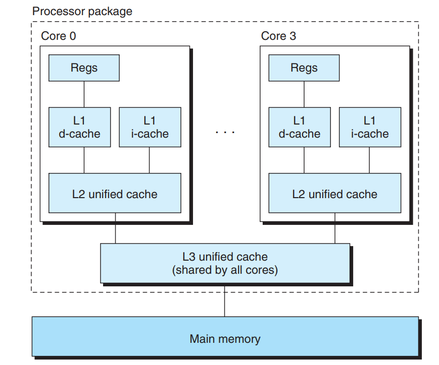

> 一般与内存最为接近的一层Cache（即Cache-主存之间）常采用“写回法+写分配法”；各级Cache之间采用“全写法+非写分配法”
>

### 缓存性能量化指标

#### Miss rate

在程序执行过程中，数据引用时访问内存次数占比：$\#\text{misses}/\#\text{reference}$

#### Hit rate

在程序执行过程中，数据引用时缓存命中次数占比：$\#\text{hits}/\#\text{reference}$

#### Hit time

从缓存向CPU传递一个字所用的时间，包括组选择耗时、确定缓存行耗时，以及确定字节位置耗时。

#### Miss Penalty

因为缓存未命中造成的多余时间。参考：L1-L2：10 cycles、L2-L3：40 cycles、L3-memory：100 cycles。

### 缓存性能影响因素

#### Cache Size

缓存大小增大有助于增加缓存命中率（hit rate）；另一方面增加了命中耗时（hit time）。

#### Block Size

更大的块有助于通过空间局部性增加缓存命中率（缓存行的相邻数据信息更多）；另一方面有限缓存大小情况下，更大的块导致更少的缓存行，所以在时间局部性上会减少缓存命中率。

> 现代系统通常包含的缓存块大小为 32 到 64 字节。
>

#### Associativity

可结合性主要指得分组中的缓冲行数目 $E$ 的选择。$E$ 的增加减少了冲突不命中的概率；然而，由于每个分组都逐一比较标记，所以会增加命中耗时（hit time），同时会增加不命中的惩罚时间（由于要算法选择受害行）。