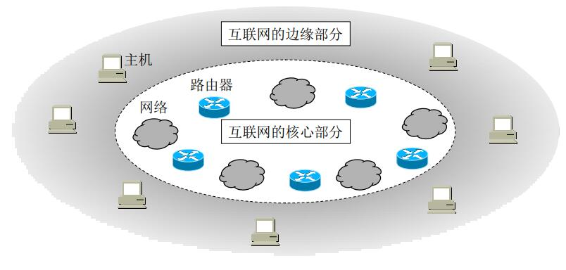

## 三类常见的网络

按照最初的分工，将网络链路的分为以下三类网络：

* 电信网路：向用户提供电话、电报及传真等服务
* 有线电视网络：向用户传送各种电视节目
* 计算机网路：使用户能在计算机之间传送数据文件

但随着技术的发展，三类网络的分工的界限逐渐模糊或消失

## 计算机网络定义

**计算机网络**（简称网络），是一些互联的、自治的计算机系统的集合。

> 描述一个网络一般由若干个结点和连接这些结点的链路组成。一般用一朵云来表示一个网络，网路中的结点可以是计算机、集线器、交换机或路由器
>

**互连网**（通用名词，internet），则是多个计算机网络互连起来，形成的范围更大的计算机网络。

**互联网**（专用名词，Internet），当前全球最大的、开放的、由众多网络互相连接而成的特定互连网。它采用TCP/IP协议族作为通信规则，前身为美国ARPANET。

> 世界上最早的计算机网络，默认为美国ARPANET
>

## 计算机网络组成

从不同的角度，计算机网络组成有不同方法的分类：

### 从组成部份上区分

* **硬件**
  > 主机（端系统）、通信链路（双绞线、光纤等）、交换设备（路由器、交换机等）和 通信处理机（网卡）组成
  >
* **软件**
  > 实现资源共享的工具类软件，多属于应用层
  >
* **协议**
  > 计算机网络的核心，规定网络数据传输时所遵循的规范
  >

### 从工作方式上区分

* **边缘部分**：由所有连接在互联网上的主机组成。
  > **由用户直接使用**，用来进行**通信**和**资源共享**
  >
* **核心部分**：由大量网络和连接这些网络的路由器组成。
  > **为边缘部分提供服务**（**连通性**和**交换**）
  >

### 从功能组成上区分

* **通信子网**
  由各种传输介质、通信设备及相应的网络协议组成，使网络具有数据传输、交换、控制和存储的能力，实现联网计算机之间的数据通信
* **资源子网**
  实现资源共享功能的设备及其软件的集合，向网络用户提供共享其他计算机上的硬件资源、软件资源和数据资源的服务。

## 计算机网路功能

* **数据通信**
* **资源共享**
* 分布式处理
* 提高可靠性
* 负载均衡

## 计算机网络分类

1. 按照**网络的作用范围**分类
   * 广域网（WAN，Wide Area Network）：交换技术
   * 城域网（MAN，Metropolitan Area Network）
   * 局域网（LAN，Local Area Network）：广播技术
   * 个人区域网（PAN，Personal Area Network）
2. 按照**网络使用者**进行分类
   * 公用网（public network）：如中国电信等ISP提供商搭建的网络
   * 专用网（private network）：如个人企业、政府部门搭建的网络
3. 按照**交换技术**分类
   * 电路交换：建立连接、数据通信、释放链路
   * 报文交换：存储转发
   * 分组交换：分组存储转发
4. 按照**拓扑结构**分类：
   * 总线型（bus）
   * 星型（star）
   * 环形（loop）
   * 网状型（net）
5. 按照**传输技术**分类
   * 广播式网络：共享公共通信信道
   * 点对点网络：使用分组存储转发和路由选择