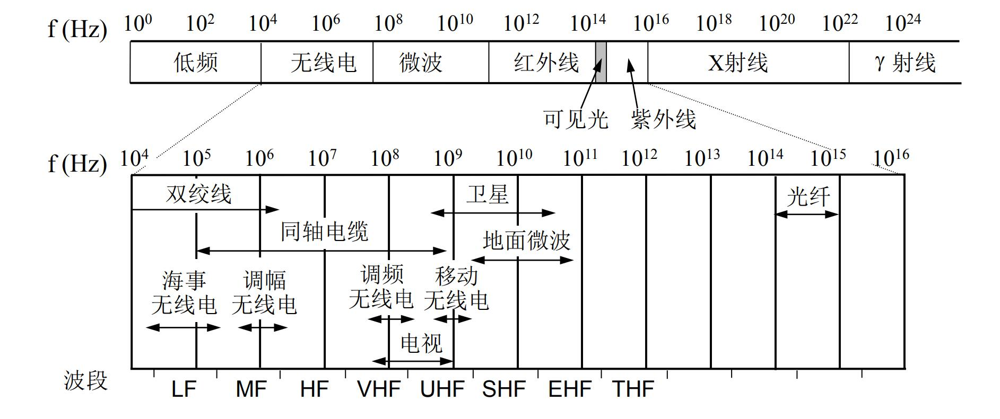
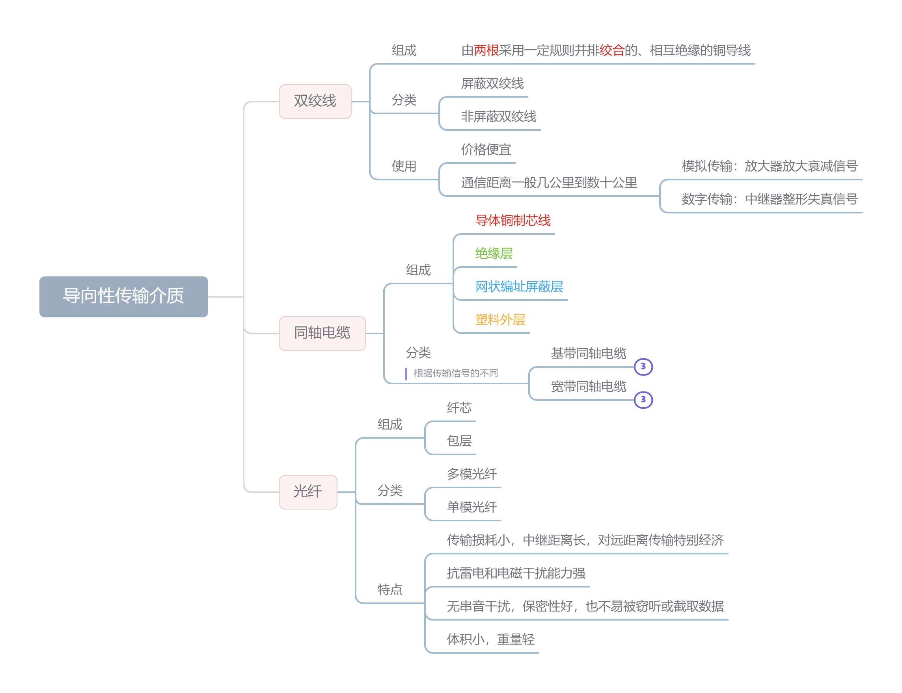
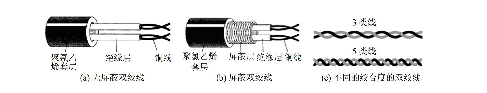
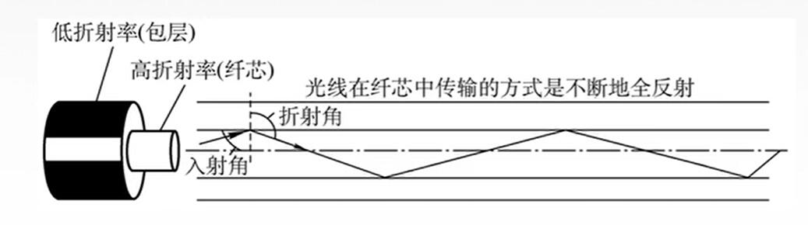
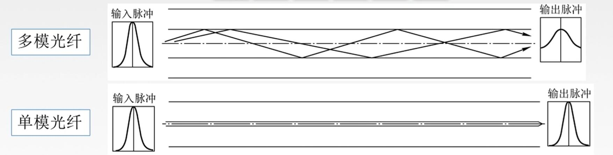
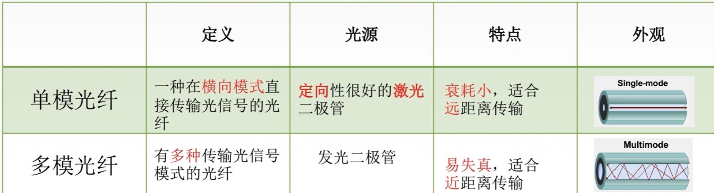
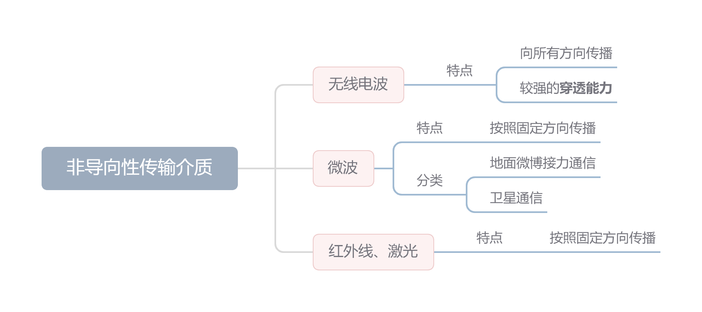

**传输介质**也称**传输媒体**/**传输媒介**，它就是数据传输系统在发送设备和接收设备之间的**物理通路**。

> 传输介质是在物理层之下的，有时称作网络体系结构的第0层
>

传输介质（媒体）可以分类为：

* 导向性传输介质（导引型传输媒体）
  > 电磁波 被导向 沿着固体媒介（铜线/光纤）传播。类似火车按照铁轨🚆。
  >
* 非导向性传输介质（非导引型传输媒体）
  > 自由空间，介质可以是空气、真空、海水。类似飞机空中导航✈️。
  >

## 导向性传输介质（导引型传输媒体）

### 1. 双绞线

把两根互相绝缘的铜导线并排放到一起，然后用规则的方法**绞合**（twist）起来就构成了双绞线。

> * 绞合可以较少相邻导线之间的电磁干扰
> * 为了进一步提高抗干扰能力，可以在双绞线外面加上一层用金属层编织成的屏蔽层
>

### 2. 同轴电缆

同轴电缆由 **导体铜制芯线**、**绝缘层**、**网状编织屏蔽层**和**塑料外层**构成。

> 按照特性阻抗数值的不同，通常将同轴电缆分为两类：50Ω同轴电缆
>

按照传输信号的不同，分为 **基带同轴电缆** 和 **宽带同轴电缆**。

### 3. 光纤

光纤通信就是利用光导纤维（简称光纤）传递**光脉冲**来进行通信，光纤一般由 低折射率的**包层** 与 高折射率的**纤芯** 组成 。

光纤可以分类为 **单模光纤** 与 **多模光纤**。

光纤的特点：

1. 传输损耗小，中继距离长，对远距离传输特别经济
2. 抗雷电和电磁干扰能力强
3. 无串音干扰，保密性好，也不易被窃听或截取数据
4. 体积小，重量轻

## 非导向性传输介质（无线传输介质）

主要分为 无线电波 、微波 、红外线于激光。